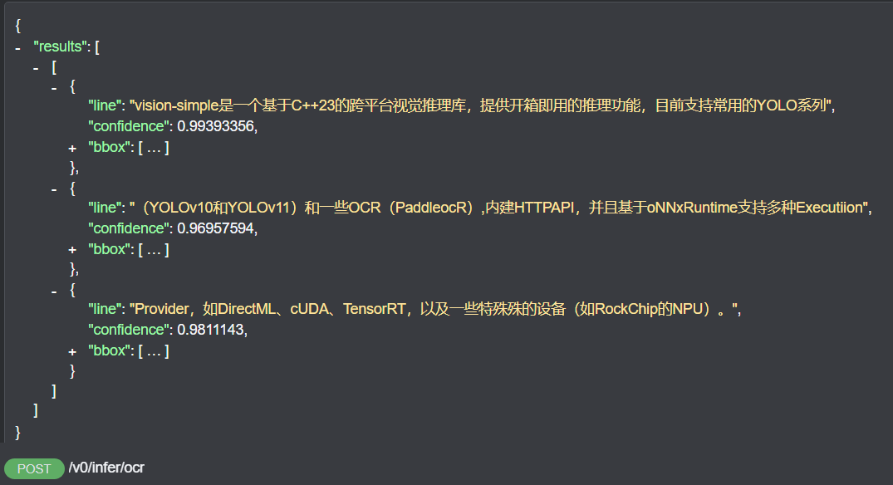

# <div align="center">🚀 vision-simple 🚀</div>
[english](./README-en.md) | 简体中文

<p align="center">
<a></a>
<a></a>
 <a href="https://github.com/users/lona-cn/packages/container/package/vision-simple"></a>
<a></a>
</p>

<p align="center">
<a></a>
<a></a>
<a></a>
<a></a>
</p>

<p align="center">
<a></a>
<a></a>
<a></a>
<a></a>
</p>

<p align="center">
<a></a>
<a></a>
<a></a>
<a></a>
</p>

`vision-simple` 是基于 C++23 和 ONNXRuntime 的跨平台视觉推理库，提供 C++ API 与独立 HTTP 服务。支持 YOLO 检测、实例分割、姿态、旋转框及 OCR，并提供检测结果跟踪、视频画面文字提取、OpenAI-like 和 MCP SSE 接入。

本文面向希望构建、部署并发起首次推理的使用者，描述**当前源码**，不表示历史发布包或镜像已包含全部功能。

**快速入口**：[构建与启动](#构建项目) · [容器部署](#docker部署http服务) · [模型配置](#任务注册与统一模型配置) · [YOLO26](#yolo26yolov26) · [协议接入](#统一服务openai-like-与-mcp-sse) · [运行测试](#运行测试)

## 特性

- **推理任务**：YOLOv10/v11/26 检测；YOLO11/26 实例分割、姿态、旋转框；PP-OCR v3/v4 CTC 与受限 SAR recognition 契约。
- **有界服务**：模型按需加载、活动租约、空闲卸载、统计、分阶段流水线与合作式取消。
- **时序处理**：ByteTrack / BoT-SORT 跟踪会话；异步 OCR 视频字幕任务，输出 SRT/WebVTT，不包含语音转写。
- **部署平台**：Windows x64、Linux x86_64，以及 ARM64、ARMv7、RISC-V 64 交叉构建配置。交叉构建不等于目标硬件运行验证。
- **执行提供者**：CPU、DirectML、CUDA、TensorRT、RKNPU 构建选项；实际可用性取决于依赖、硬件和模型导出，见兼容性说明。不承诺固定体积、内存占用或帧率。
- **接入方式**：
  - C++23 API，使用 `std::expected` 返回错误。
  - [容器部署](https://github.com/users/lona-cn/packages/container/package/vision-simple)，GHCR 发布 Linux amd64、arm64 CPU 多架构镜像。
  - **[HTTP服务](doc/openapi/server.yaml)**：提供HTTP API供Web应用调用


### <div align="center"> YOLOv11 </div>


### <div align="center"> OCR(HTTP API) </div>


## 快速使用

### docker部署HTTP服务

使用当前源码构建 CPU 镜像，避免将历史 `0.4.1-cpu-x86_64` 标签误当作最新功能：

```sh
git clone --recurse-submodules https://github.com/lona-cn/vision-simple.git
cd vision-simple
git lfs install
git lfs pull
docker build --platform linux/amd64 -t vision-simple:local -f docker/Dockerfile.debian-bookworm-x86_64-cpu .
docker run -it --rm --name vs -p 127.0.0.1:11451:11451 vision-simple:local
```

需要 Docker、Git LFS 及支持 AVX/AVX2/F16C 的 x86_64 CPU。首次构建会下载并编译依赖；镜像包含默认 YOLO11/PP-OCR 配置及测试模型，不包含 YOLO26 权重。发布镜像的选择与校验见[GHCR 多平台发布](#ghcr-多平台发布)。

在另一终端执行 `curl http://127.0.0.1:11451/v0/infer/models`（Windows 可用 `curl.exe`）检查模型目录。目录成功只证明配置可发现，不证明权重加载或推理成功；完整请求示例见[发起推理](#发起推理)，默认检测模型改用 `hd2-fp32` 即可。

完整接口见 [OpenAPI](doc/openapi/server.yaml)。推理和用户 job API **没有认证或租户隔离**；不要将后端直接暴露到公网。原生默认监听 `127.0.0.1`；Docker 显式监听容器接口，本例仅发布宿主回环。共享缓存管理默认关闭，须按下方策略显式启用 bearer。

### HTTP v0 错误与批量语义

`yolo`、`seg`、`pose`、`obb` 的原生 v0/v1 请求支持可选顶层数值 `confidence`、`nms_iou`，范围 `[0,1]`。省略 confidence 为 `0.125`；省略 raw NMS IoU 时检测为 `0.3`，分割/姿态/OBB 为 `0.45`。end-to-end 导出仍校验 `nms_iou`，但不应用它、不执行第二次 NMS。控制只影响本请求的每张图片；confidence 改变目标筛选，不改变 mask 二值化或关键点置信度。OCR 拒绝任一显式字段，即使值等于默认值；现有 `0.125` recognition 阈值抑制逐个 token，不是检测像素阈值或整行过滤。

布尔、null、字符串、数组、对象及有限越界控制值均无效。语义校验先于模型查找/图片解码，空批次也校验：原生/OpenAI 返回 HTTP 400 `invalid_request`（`stream:true` 也返回普通 JSON），MCP 返回当前版本的文本/structured `isError:true` 工具结果，不新增 JSON-RPC 错误。transport 接纳与取消/截止时间/关闭优先级不变；NaN、Infinity 或溢出等不可表示的 JSON 数字在任何位置（包括嵌套、无关字段及较早的重复键）均按既有解析错误拒绝：原生 `invalid_request`、OpenAI `invalid_json`、MCP `id:null` 的 JSON-RPC `-32700`，不静默丢弃或回退默认值。省略字段保持既有 JSON 行为。

成功字段保持不变：YOLO 返回 `class_names`/`results`，OCR 返回 `results`。`model` 必须为非空字符串，`images` 必须为字符串数组；有效模型接受空数组。HTTP 200 保证结果数量与输入数量相等、顺序一致；某张图没有目标时，该项为空数组。

任一图片失败即整批失败，不返回部分结果。顺序为请求校验、模型查找/加载、取消/超时/关闭检查、请求 credit 接纳、按索引 header 预检、整批字节预留、全部图片解码、流水线推理、序列化；模型/配置失败仍优先于图像接纳错误。

```json
{"error":{"code":"invalid_image","message":"Image cannot be decoded","image_index":1}}
```

| HTTP | `error.code` | `image_index` |
| --- | --- | --- |
| 400 | `invalid_request`、`unknown_model` | `null` |
| 400 | `invalid_image`、`image_limit_exceeded` | 从 0 开始的图片索引 |
| 500 | `model_load_failed`、`model_config_failed`、`internal_error` | `null` |
| 500 | `inference_failed` | 从 0 开始的图片索引 |
| 503 | `service_overloaded`、`service_unavailable`、`request_cancelled` | `null` |
| 504 | `request_timeout` | `null` |

旧客户端需从“HTTP 200 + 文本错误”迁移为检查 HTTP 状态和 `error.code`，不能依赖 `message` 文案。第三方异常细节仅保留在日志。完整契约见 [OpenAPI](doc/openapi/server.yaml)。

### 模型生命周期与并发

- `POST /v0/infer/unload` 接受 `{"kind":"yolo","model":"hd2-fp32"}`；`kind` 支持 `yolo`、`ocr`、`seg`、`pose`、`obb`。空闲模型卸载返回 `200 {"kind":"yolo","model":"hd2-fp32","unloaded":true}`；活动模型返回 `409 model_busy`；未加载返回 `404 model_not_loaded`。后续推理自动重新加载。卸载和 stats 覆盖五种任务，只有旧 `/v0/infer/models` 目录限于 `yolo`/`ocr`。
- `GET /v0/infer/stats?limit=100&offset=0` 返回 `models`、`total`、`limit`、`offset`、`idle_timeout_ms` 和服务级 `image_budget`（见下文）；limit 范围 1–200。模型按 `(kind,name)` 排序，字段为 `kind`、`name`、`active_requests`、`requests`、`failures`、`total_duration_ms`、`last_used`（Unix 毫秒）。模型计数属于当前已加载实例，重新加载后重置；加载前的请求错误不计入实例统计，耗时含等待工作区的时间。
- `config/server.yaml` 的字符串 options：`infer_idle_timeout_ms: "300000"`，`infer_sweep_interval_ms: "1000"`。空闲时间从最后一次请求结束计算，使用单调时钟；timeout 为 `"0"` 关闭自动卸载，扫描间隔必须为正整数。
- 活动租约涵盖解码、等待推理、后处理及响应序列化/发送调用；手动和定时卸载均不删除活动实例。同步 C++ `Run` 每模型串行；HTTP 流水线使用独立任务工作区，同一会话的 ORT 执行受锁保护。
- 卸载释放 session 和模型工作区，但共享 ORT arena / provider 可能保留内存，不保证 RSS 或显存立即下降。YOLO 结果的 `class_name` 仍引用模型元数据，C++ 调用者须让模型活得比结果视图更久。
- stats/unload 使用下方管理员策略；授权后的阻塞管理使用独立有界 control lane，health 绕过两条 lane。

### 共享缓存管理与部署

只有 `GET /v0/infer/stats` 和 `POST /v0/infer/unload` 是管理员操作。推理、配置目录、health、tracking session、字幕 job、OpenAI-like HTTP 和 MCP 保持既有权限：**没有内建用户认证或租户隔离**。CORS、浏览器 Origin 限制、job/session ID 和 OpenAI SDK `api_key` 都不是认证。后端须保持私有；公开访问需要 TLS 鉴权代理，并分开推理和管理员授权策略。

管理默认关闭：省略或空字符串 `http_management_token_env` 返回 `403 management_disabled`。启用时，在部署配置的 `options` 下设置 `http_management_token_env: "VS_MANAGEMENT_TOKEN"`，启动前通过外部秘密管理向服务进程提供同名环境变量。这只是示例名，**不是默认名**。名称须匹配 `[A-Za-z_][A-Za-z0-9_]*`，最多 128 字节；值须为 1–4096 字节可见 ASCII，不含空白或控制字符。建议使用至少 32 随机字节编码的高熵秘密；不把值写入 YAML、镜像层、命令、URL、cookie 或日志，服务不会自动生成凭证。名称无效或显式配置的变量缺失/空值/不安全会使启动失败，不回退到无认证。秘密仅加载一次；轮换须更新外部值并重启。

请求发送 `Authorization: Bearer <secret>`；header 名和 Bearer scheme 不区分大小写，秘密字节区分大小写。缺失/错误凭证返回 `401 management_unauthorized` 与 `WWW-Authenticate: Bearer realm="vision-simple-management"`；即使回环或代理请求也必须有正确凭证。随后检查 Host：只能是 `localhost`、`127.0.0.1`、`[::1]` 或显式非 wildcard 的监听 host，端口须匹配后端 listener。wildcard bind 不代表任意 authority 可信。缺省 Origin 允许 CLI；提供时须是可信 HTTP(S) 后端 authority，不含路径/query/fragment/userinfo。空、`null`、畸形 Origin 或不可信 Host 返回 `403 management_forbidden`。忽略 Forwarded/X-*，不接受 query/cookie 凭证。

guard 在 headers 完成时执行，先于接收正文、`100 Continue`、队列接纳、JSON 解析及模型/cache 操作；control lane 满时仍先拒绝未授权请求，不泄露加载/忙状态。unload 要求精确 `Content-Type: application/json`、最多 64 KiB，授权后才允许 `Expect: 100-continue`；stats 拒绝正文。未完成的被拒绝上传按 HTTP parser 规则丢弃或关闭。管理路径不使用宽松 CORS，OPTIONS 返回 403；普通推理 CORS 不变。授权后的分页 400、unload 404/409/200、有界 control overload `503 service_overloaded` 与 `Retry-After: 1` 保持不变。管理错误为 `error.{code,message,image_index}`，`image_index` 为 null，不回显凭证。
原生 JSON/早拒绝/不发送 Continue/无宽松 CORS 契约仅适用于匹配管理 state handler 的请求。畸形 HTTP framing 可在 libhv callback 前失败；畸形 Host authority 也可能改写路由，落到未匹配的通用路径。实测尾随斜杠 Host 的 GET 返回通用 404 HTML、宽松 CORS/keepalive；带 Expect 的 POST 先发通用 100 Continue，正文后才返回最终通用 HTTP 错误。这些库响应不代表管理授权或 Stats/Unload 执行，不发生模型/cache 管理。

原生配置监听 `127.0.0.1:11451`。六个 Dockerfile 在复制 target 配置后仅将已暂存 host 改为 `0.0.0.0`，管理仍默认关闭，镜像不含凭证。仅发布到宿主回环（`-p 127.0.0.1:11451:11451`）或私有网络；映射到不同宿主端口不会改变后端 authority 的 11451 端口。

nginx 推理代理默认精确拒绝两个管理路径（query 不影响 location 匹配）：

```nginx
location = /v0/infer/stats { return 403; }
location = /v0/infer/unload { return 403; }
```

仅在显式管理员授权的 TLS/私有代理路由启用转发，不在通用推理路由启用。先配置外部管理员鉴权，再替换上述 deny location；每个授权 location 均须转发到私有后端并保留调用者 bearer，例如原生回环后端的以下指令：

```nginx
proxy_pass http://127.0.0.1:11451;
proxy_set_header Authorization $http_authorization;
proxy_set_header Host 127.0.0.1:11451;
proxy_set_header Origin http://127.0.0.1:11451;
```

这些指令不是完整 TLS/鉴权配置。代理须先授权原始客户端 Origin，再重写；重写本身不是授权。CLI 可保留缺省 Origin。容器代理使用实际私有后端地址，并将 Host/Origin 重写为后端接受的 authority。不能向普通推理流量注入共享管理员 bearer，不能用转发 IP/回环代替认证；代理 access/error 日志也不能记录秘密。MCP 转发仍独立保持原有 Host/Origin 检查，需关闭 SSE 缓冲并允许长连接。

当前新版的故障关闭配置回滚：删除/清空 `http_management_token_env` 并重启，管理关闭、推理仍可用。保留配置名但取消环境变量会使启动失败。**保护引入前的旧 binary 会忽略新 option，重新开放无鉴权管理。** 回滚 binary 前须先保持代理对两个管理 exact path 的硬拒绝及私有后端隔离，再验证外部管理请求仍被拒绝；仅在 YAML 保留新 option 不能保护旧 binary。

### HTTP 调度与健康检查

所有端点共用同一 listener 和四个 IO loop；阻塞推理、模型/cache 操作、tracking 与字幕磁盘/管理工作移出 IO loop。字符串 options 为 `http_data_workers: "4"`、`http_data_queue_capacity: "4"`、`http_control_workers: "1"`、`http_control_queue_capacity: "4"`；worker 范围 1–32，queue 范围 1–128。data/control 两条 lane 分别有界，每条 lane 的已接纳 handler 驻留总数（包括等待 IO completion callback 的已完成工作）不超过 workers + queue。管理请求也可能 overload，不是无限优先通道。

字幕 video 上传使用 data lane，避免暂停上传霸占默认唯一 control worker；字幕 metadata 管理仍使用 control lane。streaming 上传可在完整正文前持有 transport handler，但不取得推理 image credit。取消暂停上传会唤醒上传 worker；缓冲和文件实际排空后释放 transport 槽并关闭未完成的 PUT，无需客户端主动断连。

支持顺序 HTTP keepalive；异步 handler 活动期间，同连接发送第二个 pipeline 请求将安全关闭连接。并发请求应使用不同连接。

完整正文接收后、业务 JSON 解析前进行 transport 接纳；lane 满或停止时按该端点错误格式返回 `503 service_overloaded` 与 `Retry-After: 1`。接纳后的推理保持模型/配置及空批次/错误优先级。transport slot 限制 handler 生命周期，**不是图像像素额度**；排队不取得共享服务 ImageCredit 或解码字节。仅共享服务按 `infer_pipeline_max_batches` 与解码预算接纳 v0/v1/OpenAI/MCP 图像工作。有效模型空批次不占 image credit，但仍须通过 transport 接纳。

`GET /livez` 返回 `200 {"status":"alive"}`；`GET /readyz` 在可接纳且未停止时返回 `200 {"status":"ready"}`，draining 返回 `503 {"status":"not_ready"}`。两者绕过模型加载、cache/inference 锁和 dispatch 队列。暂时 queue 满不改变 ready；健康端点不保证模型有效、权重已加载或已 warmup。Docker 用两秒期限探测 `/livez`，避免仅因推理繁忙而重启存活服务。

HTTP 推理 deadline 从完整正文提交调度时开始，包含 queue 等待、模型加载和解码。断连请求合作式取消，已执行原生调用与输入仍须物理 drain 后才返还图像额度。关闭先置 not-ready 并拒绝接纳，取消排队/活动 handler，停止 adapters，等待 workers 与 IO completions drain，最后停止 listener。

真实 PP-OCR 回归：`python scripts/test_http_dispatch.py --server <executable> --project-root .`。输出 idle/load 原始 RTT 与 P50/P95/P99，逐次观察四个图像接纳，再检查 transport overload、排队 timeout、control 请求、MCP 共享预算、慢客户端及关闭。不设置 RSS 或机器相关毫秒阈值；健康期限采用实际 Docker 消费者的两秒上限。


### 显式模型预检、预热与计时

部署前检查选定模型时，可使用服务可执行文件的本地诊断模式。从与 HTTP 服务相同的工作目录运行，准备好 `config/server.yaml`、`config/models.yaml` 及配置的模型文件；不支持任意配置路径选项。默认目录包含 `yolo:hd2-fp32`、`yolo:hd2-fp16`、`ocr:ppocr-v4`，但“已配置”不代表文件存在或可推理。将下方 `fixture.jpg` 替换为自己的代表性图片。

```sh
./vision_simple-server --help
./vision_simple-server --diagnose preflight --model yolo:hd2-fp32 --model ocr:ppocr-v4
./vision_simple-server --diagnose warmup --model yolo:hd2-fp32 --image fixture.jpg --timeout-ms 60000
```

Windows 使用 `vision_simple-server.exe`。无参数保持原有 HTTP 启动及按需加载；`--help` 在配置、日志及 listener 初始化之前成功退出。诊断不启动 listener，不要求 HTTP 管理密钥或日志配置。非空的未知/错误参数退出 2，不会意外启动服务。此功能仅为 CLI：HTTP routes、OpenAPI、base 配置与 health 语义不变，健康检查不会自动加载全目录。

- 用 `--model task:name` 显式选择 1–16 个不同条目，task 支持 `yolo`、`ocr`、`seg`、`pose`、`obb`。拒绝重复选择；默认不会加载所有模型。
- `preflight` 不接受图片，每个加载尝试调用一次空批次 measured service：检查必需文件角色并真实初始化会话，但不执行图片推理。`warmup` 要求重复传入 1–`min(infer_max_batch_images,128)` 个 `--image`，每个选定模型使用同一有序批次。原始夹具总量上限为 48 MiB（50,331,648 字节），base64 总量为 64 MiB（67,108,864 字节）。仍通过既有服务执行像素、解码字节、请求 credit、流水线预算、调度及租约规则，不绕过资源接纳。
- warmup 先在新服务缓存中执行完整 cold 批次，**不做空批次预加载**，成功后在同一服务执行一次完整 warm 批次。cold 响应持有模型租约直到 warm 调用结束，即使 idle timeout 极小也不会在两次之间卸载。两份响应标记成功并释放后才显式 unload；按选择顺序串行处理，因此缓存上限为 1 仍可使用。cold 失败不会伪造 warm pass；已加载模型在下一选择前卸载，卸载失败不能报告成功。
- 每次调用独立使用 `--timeout-ms`（1–300000），省略时使用配置的推理 timeout。超时是合作式的，原生调用必须 drain，实际返回可能超过 deadline。preflight 每选择花费一次会话加载；成功 warmup 花费一次加载和两次完整夹具批次，包括 OCR 所有检测/recognition 循环。没有后台保温或持久缓存承诺。重复命令是新进程/新服务缓存；cold 不表示 OS 文件缓存、runtime/device 缓存或物理硬件处于冷态。

JSON 使用 `schema_version: 1`、`validity: "this_invocation_only"`、`http_readiness: "not_assessed"`，模型按选择顺序输出。`configured` 仅表示目录成员；未尝试加载时 `loadable` 为 null，之后依据真实加载完成/cache reuse；`smoke_tested` 要求夹具推理成功。状态明确区分 `not_configured`、`missing_files`、`load_failed`、`loadable`、`smoke_failed`、`smoke_tested`：文件存在但损坏属于加载失败，加载成功后的输入相关失败属于 smoke 失败。缺失文件只输出角色名（`model`，或 OCR 的 `det`/`rec`/`dictionary`）。pass 输出归一化错误 code、可选图片索引、cache_hit、batch_size、每帧目标/文本行数量，不输出检测内容、mask、OCR 文字、像素或 base64。报告和诊断错误不回显物理路径、密钥、环境/配置 options map 或原生异常消息。

退出 0 表示所有选择均达到要求状态（preflight 为 `loadable`，warmup 为 `smoke_tested`）、各次尝试及清理成功，且报告成功写入并 flush 到 stdout。若 preflight 在成功加载会话后超时，仍可报告 state 为 `loadable`、`loadable: true`，但 pass 失败、错误为 timeout、退出 1；可加载不等于操作成功。配置/context/夹具、模型、smoke、资源、timeout、unload 或报告 write/flush 失败退出 1；配置前参数误用退出 2。`--help` 同样仅在输出成功写入并 flush 后退出 0。输出失败使用静态 stderr 诊断，不回显原生错误或传入值。成功退出不证明 HTTP ready、未选模型有效或其他输入可推理。顶层致命错误使用静态消息及 `configuration_failed`、`context_failed`、`fixture_failed`、`diagnostic_failed`、`invalid_arguments` code。

**能力分层解读。** 报告包含 framework/runtime version、实际编译的 EP append 支持、runtime available-provider 列表、请求的 EP/device ID、context 创建及 `cpu_fallback_allowed`。公开 C++ `InferContext::Capabilities()` 不加载模型即可查询 runtime 事实。context 接纳、编译支持、runtime provider 可用与所选模型 smoke 成功是不同结论。允许 CPU fallback；请求某 provider 或 smoke 成功不证明每个算子实际在该 GPU/device 执行，不声称硬件 placement。

**计时是 elapsed wall，不是 kernel benchmark。** cold/warm pass 包含请求 `wall_ns`；服务 `model_acquire`、`model_load`、`input_prepare`（base64/header 准备）、真实图片 `decode`；流水线 `wall_ns`、驻留 `capacity_wait_ns`、任务 `setup_ns` 及 `preprocess`、`inference`、`postprocess`。图像处理的五类耗时为 decode、preprocess、queue、inference、postprocess；各流水线阶段分开记录 `queue_ns`（入队至 Advance 开始）和 `execution_ns`。阶段含 `calls`/`completed_calls`，流水线含 `input_frames`/`completed_frames`/`complete`；服务阶段使用 `elapsed_ns`。四个服务阶段在 `calls` 为零时是 null；整个流水线仅在未进入时为 null。进入后，各流水线阶段始终保留四字段记录（`execution_ns`、`queue_ns`、`calls`、`completed_calls`），即使未执行。阶段 `calls: 0` 表示 execution 未到达，不是测得瞬时 inference；`queue_ns` 仍可能含被跳过任务的部分排队等待。失败在原生 drain 后保留部分工作/等待计数，真实 elapsed 为零可能只是时钟分辨率。OCR 包含全部阶段访问及 crop-recognition 循环。多帧、多 worker 的阶段耗时会重叠，求和**不等于** batch wall。inference 含会话 gate 等待、binding 与 output 工作，不是纯 ORT/GPU kernel 时间。请求 wall 包含结果打包，但没有单独 packing 阶段。

**显式测量 API 决策。** 比较了向 controls 加 output-profile 指针、observer callback、拥有结果的 measured 返回值三种设计。`InferPipeline::RunMeasured` 和私有 service `RunMeasured` 采用第三种：按值拥有普通结果及固定计时记录，避免改变 `PipelineControl`/`ServiceControl` 布局及 output 指针所有权、observer 生命周期/callback 问题。普通 `Run` 行为不变；关闭测量时除 nullable-profile 分支外不增加时钟读取、堆分配或结果复制。新 API 使用者须重新构建/链接更新库；没有被替换的旧 API 需要兼容 shim。observer 本身有成本，解释细小差异前应对代表性夹具比较 measured/unmeasured 原始样本与中位数；不承诺通用开销百分比或跨机器速度阈值。

**实测 observer 成本。** Linux x86_64 CPU 容器运行于 WSL2 kernel 6.6.87.2，使用 GCC 16.2.0（`O3`、fast-math）、ONNX Runtime 1.22.0、ONNXRUNTIME/CPU device 0，模型为 384 字节的 `yolo26_detect_threshold_raw.onnx` kV26 raw detection 夹具（FP32 输入 `[1,3,64,64]`）。批次为一张 32×32 全黑 `CV_8UC3` BGR 图片，confidence 0.5/NMS IoU 0.3；service 复用一次生成的 PNG/base64。保持同一存活 context/model/cache，持有首次成功响应租约，idle timeout 为零。setup、加载及 4 对 warmup 不计时。之后每个 API 执行 40 对调用，偶数对普通模式先执行，奇数对 measured 先执行；外部 steady-clock 只计调用本身，不含结果对比、`Succeed`、析构。中位数为排序后第 20、21 个样本均值向下取整。普通/measured 中位数：pipeline 为 204.208/180.008 µs（204,208/180,008 ns，差 −24.200 µs），service 为 176.263/216.701 µs（176,263/216,701 ns，差 +40.438 µs）。全部 80 对 class、confidence 位、bbox 及 service class names 精确一致，service measured 调用报告 warm cache hit 和 complete timing。pipeline 负差值是调度噪声，不是加速结论。这些特定夹具观察不是通用开销估计、硬件 placement 证明或性能保证；三个 worker 的阶段时间求和仍不等于 batch wall。

### 私有 OCR 预热图片导出（显式启用）

导出会持久化可能敏感的输入像素：仅对明确批准的图片启用，并从可信当前工作目录运行。不传 `--debug-dir` 时普通 CLI/HTTP 不保存 debug 图片，也不增加 debug 分配或文件系统探测。

```sh
./vision_simple-server --diagnose warmup --model ocr:ppocr-v4 --image fixture.jpg --debug-dir ocr-study-001 --debug-max-bytes 67108864 --debug-max-files 64
```

Windows 将可执行文件换成 `.\vision_simple-server.exe`。仅允许 warmup、**恰好一个 OCR 模型**及 1–16 张图片（原有批次/输入预算仍适用）。`--debug-max-bytes` 范围 1–67108864，默认 67108864；`--debug-max-files` 范围 1–64，默认 64；两者均必须与 `--debug-dir` 使用。上限包含 manifest、全部关闭的文件及实际编码字节，含边界，不能提高到硬上限之外。

NAME 必须为 1–64 字符的可移植 ASCII basename，首字符字母/数字，其余仅字母/数字/下划线/连字符。所有平台均拒绝点、路径分隔符、绝对/drive 路径以及不区分大小写的 Windows 保留名 CON/PRN/AUX/NUL/COM1–9/LPT1–9。CWD 的直接子项不得已存在，包括文件、目录、symlink、junction；不覆盖/复用，也不回退到其他位置。POSIX 要求 CWD 归当前 UID 所有且无 group/world 写权限；独占创建目录 mode 0700、文件 0600，并使用固定身份的 no-follow 相对句柄。Windows 使用受保护的仅当前用户 DACL、固定相对 no-reparse 句柄及独占创建。

框来自已有成功 warm 响应，**不再进行第二次推理/检测**。复用编码输入，每次最多处理一帧：先写原始 PNG，再在同一 Mat 上画框和数字索引生成 overlay；不导出 detector mask 或 recognition crop。文件为 `input-000.png`、`boxes-000.png`（三位帧序号）及 `manifest.json`，共 `2 * frames + 1` 个。manifest 包含 `schema_version: 1`、有效 `ocr_detection`、`recognition_confidence: 0.125` 与 `frames`；帧字段为 `index,width,height,box_count,boxes`，框字段为 `index,bbox:[x,y,width,height],confidence`。report/manifest 不含识别文字、路径、token 或夹具 base64；PNG 本身仍包含明确批准的输入像素。

stdout 仅增加 `debug: {files,bytes,retained,error}`（error 为归一化 code 或 null），不回显目录名/原生异常。仅在模型达到目标状态、释放租约、unload 成功并成功写入/flush stdout 后保留文件。模型、decode/encode、IO、quota、异常或 stdout 失败退出 1，仅回滚创建的已知文件及自己拥有的新目录，不对无关目录树调用 remove_all；参数误用退出 2。检查全部写入/关闭，失败不故意保留部分导出。stdout 失败可能没有可用报告，应依据退出码而非部分输出。

退出 0 且 `retained: true` 后可检查结果；使用完后，仅删除**确切新建且仍未被替换的导出目录**。以上名称对应：

```sh
rm -r -- './ocr-study-001'
```

```powershell
Remove-Item -LiteralPath '.\ocr-study-001' -Recurse
```

不要替换成父目录、通配符或无关已有目录。成功导出不会自动删除。


### 有界推理流水线

HTTP v0 在全部图片解码成功后，使用前处理、ORT、后处理三个独立 worker；OCR 按检测及文本框 recognition minibatch 的依赖关系轮转阶段。图片结果按输入索引聚合；不同图片即使乱序完成，仍只返回最低失败索引，整批不返回部分结果。

服务 options 支持 `infer_pipeline_capacity: "4"`（驻留阶段任务数，1–64）、`infer_pipeline_max_batches: "4"`（已接纳批次数，1–64）、`infer_max_batch_images: "128"`（每批图片上限，1–4096）、`infer_timeout_ms: "60000"`（默认推理截止时间，1–300000 毫秒）。这些限制不等价于图像像素/字节数上限。

解码输入预算 options（正整数字符串）为 `infer_max_image_pixels: "16777216"`、`infer_max_batch_decoded_bytes: "67108864"`、`infer_max_inflight_decoded_bytes: "268435456"`，覆盖共享 v0/v1/OpenAI/MCP 推理服务，**不覆盖独立 tracking 服务**。预检严格解码 base64 一次，只读 header、不调用 `imdecode`；本构建支持 PNG、JPEG、BMP、P1–P7、PF/Pf、Radiance HDR、Sun Raster，WebP 需启用相应 codec；TIFF/JP2/EXR/AVIF 未启用。宽高须为正且不超过 `INT_MAX`，像素及字节乘加均检查溢出。实际采用 OpenCV 默认彩色解码并遵循 EXIF 方向；宽高交换不改变像素额度，并复核像素总数及 `CV_8UC3`。
上述列表是 header 预检范围，不保证任意 payload 都能推理；实际 codec 解码失败或输出不是 `CV_8UC3` 时仍返回 `invalid_image`。例如当前 OpenCV 4.10 的灰度 PFM（`Pf`）即使使用彩色标志仍输出 `CV_8UC1`，因此推理拒绝该图，不额外归一化。

字节估算仅为 BGR 输入的 `width * height * 3`，不是 RSS 上限，不含压缩正文、codec 临时内存、模型 arena、工作区及响应 mask。单图超限或第一个累计批次超限返回 `400 image_limit_exceeded` 和该图索引，整批尚未开始任何解码；base64/header 无效按顺序返回首个 `400 invalid_image`。请求 credit 从预检覆盖至物理推理结束，上限是 `infer_pipeline_max_batches`，不是驻留任务 capacity。credit 满时先返回 `503 service_overloaded`，不做 base64/codec 工作；全局字节满时在预检之后、解码之前返回同一错误。

stats 新增服务级 `image_budget`：`in_use_bytes`、`peak_bytes`、`active_requests`、`decode_calls`（只计真实 imdecode 开始）、`rejected_requests`（预算接纳拒绝），模型卸载不重置。任务 drain 并析构输入后才返还额度；完成响应仅持模型租约，不持像素或额度。普通 HTTP 与 MCP 断连请求合作式取消，但不能打断 ORT 或提前返还物理占用。
共享服务与原生 v0/v1 推理支持有效模型空批次，保留空结果及控制检查，不消耗图像 credit、字节或 decode_calls；其他请求占满图像预算也不改变此行为，但仍须通过 transport 接纳。MCP 工具既有 images minItems=1，空数组返回 invalid_request；OpenAI chat 同样要求实际图像，不提供原生空批次语义。

请求可附加整数 `timeout_ms`（1–300000）覆盖默认 deadline；HTTP 从完整正文提交调度时计时，包含 queue 等待、模型加载和解码，不对序列化、网络或原生调用作硬实时保证。超时为 `504 request_timeout`，接纳耗尽为 `503 service_overloaded` 与 `Retry-After: 1`，控制错误 image_index 为 null。取消优先于超时，再优先于关闭；有服务 credit 时图像校验优先于全局字节接纳，无 credit 时服务 overload 优先于无效图像。

C++ YOLO/任务调用者使用 `InferPipeline::Create`，再调用 `Run(model, images, YOLOInferenceOptions{.confidence = 0.1f}, PipelineControl{stop_token, deadline})`；OCR 保留 `Run(model, images, float confidence, control)`。options 按值捕获到本批次，不写入调度 `PipelineOptions` 或模型/context/cache 状态。`Close()` 拒绝新任务并取消未完成批次，销毁前等待所有调用者退出。取消优先于超时、关闭和普通错误；Run 等待已执行原生阶段与输入析构完成后才返回。输入像素及模型须在整个调用期间有效，外部不得修改像素。HTTP 与 MCP 断连请求合作式取消，不能硬打断原生调用。

同步 `InferYOLO`、`InferYOLOTask` 和 `InferOCR::Run` 与流水线共享阶段算法和会话执行锁；YOLO 调用现在接受 `YOLOInferenceOptions`，OCR 保留标量 confidence 签名。流水线任务拥有独立工作区，每个模型最多缓存 2 个空闲流水线工作区。未加入流水线适配的自定义模型返回明确错误，不以同步调用伪装分阶段执行。

### 任务注册与统一模型配置

在 `config/models.yaml` 中声明模型，使用 `(task,name)` 标识。原生 v1 与 MCP 使用配置原名，OpenAI-like 使用 `<task>:<name>`。以下为默认配置的 FP32 检测与 OCR 条目：

```yaml
models:
  - task: yolo
    name: hd2-fp32
    version: kV11
    files:
      model: assets/hd2-yolo11n-fp32.onnx
  - task: ocr
    name: ppocr-v4
    version: kPPOCRv4
    files:
      det: assets/ppocr_det.onnx
      rec: assets/ppocr_rec.onnx
      dictionary: assets/ppocr_keys_v1.txt
```

旧 `yolo`/`ocr` 配置仍可读，也可与不冲突的新条目混用。重复 `(task,name)` 一律拒绝；不同任务允许同名。版本和模型资源检查仍在首次模型加载时执行。旧配置 DTO 保留兼容投影，执行路径只读取 canonical `models`，没有两套缓存或配置查找逻辑。

当前注册 `yolo`、`ocr`、`seg`、`pose`、`obb`，未知 task 在服务配置边界拒绝。各任务共用缓存、租约、统计和回收逻辑。实际推理后端为 ONNXRuntime，不支持 TVM；任务注册表不是动态插件系统。

### OCR 模型构造参数

可选 `ocr_detection` mapping 属于 OCR 模型定义，可用于 canonical `models` 条目或 legacy `ocr` 条目；canonical/legacy 投影、导入导出及配置复制均保留它，**不是请求级控制**。

| 字段 | 含端点范围 | 默认值 | 含义 |
| --- | --- | --- | --- |
| `kernel_size` | 1–32 | 2 | 正方形 `MORPH_RECT` 膨胀核 |
| `dilation_iterations` | 0–8 | 3 | 膨胀次数；零直接使用转换后的灰度 mask，不膨胀 |
| `min_box_area` | 0–1048576 | 64 | 严格保留 unclip 前 `boundingRect.area() > min_box_area`；不是 contour area |

在上方 canonical OCR 示例中，与 `files` 同级添加以下字段（legacy OCR 条目亦可）：

```yaml
    ocr_detection:
      kernel_size: 1
      dilation_iterations: "1"
      min_box_area: 16
```

省略/null 继承默认值；`ocr_detection: {}` 显式选择默认值；省略的单个字段也采用默认值。接受裸写或加引号且完全解析的十进制整数；拒绝未知 leaf key、布尔、浮点、嵌套值及越界整数。非 OCR 模型的非 null mapping（包括 `{}`）被拒绝，null 视为省略。外层 YAML 原有未知字段及重复 key 取最后值策略不变（重复模型声明仍被拒绝）。

C++ 使用轻量公共 common header `OCRDetectionOptions.h`，aggregate `OCRDetectionOptions{kernel_size, dilation_iterations, min_box_area}` 提供 constexpr 校验及相等比较。全部 `InferOCR::Create` 文件、byte-span、arithmetic-span template 重载在 `device_id = 0` **之后**追加 `OCRDetectionOptions detection_options = {}`。factory 在文件 IO/会话创建前校验，模型按值持有构造快照；修改调用者的值不改变模型。SDK 及调用者须重新构建/链接，不保留旧符号 shim，也不提供 setter。

默认仍为 2/3/64，保持旧 anchor/border 和三次物理膨胀调用。kernel size 1 是数学恒等操作，其实现避免无用分配/膨胀，不改变默认路径。灰度转换保持 CV_8UC1，不增加阈值/scaling。CTC/SAR、recognition batch/confidence、unclip ratio 1.5、IoU/筛选顺序、坐标映射、`Run(image, float)`、pipeline/measured 调用及 control 布局不变。采用构造值加 CLI 框叠加，而不是引入 callback 生命周期/debug runtime port。普通 HTTP/OpenAI/MCP JSON 与 OpenAPI 不变：没有请求级形态学参数、setter、debug 或 detector HTTP API。

### YOLO 分割、姿态与旋转框

使用自行提供的兼容导出模型添加 canonical 配置（以下文件名不表示仓库附带权重）：

```yaml
models:
  - task: seg
    name: segment
    version: kV11
    files: {model: assets/yolo11n-seg.onnx}
  - task: pose
    name: pose
    version: kV11
    files: {model: assets/yolo11n-pose.onnx}
  - task: obb
    name: oriented
    version: kV11
    files: {model: assets/yolo11n-obb.onnx}
```

- YOLO11 导出须具有静态 `[1,3,H,W]` 输入、静态 FP32/FP16 原始输出及类别名称元数据，不得包含导出 NMS/end-to-end 后处理。YOLO26 的两种导出模式见下节。分割需要预测和通道匹配的 mask prototype；姿态使用关键点通道（`kpt_shape` 支持 2 或 3 个分量）；OBB 需要一个角度通道。不支持动态维度、batch>1、任意 YOLO 架构或内嵌 NMS 图。
- 五个 task 均可调用 `POST /v1/infer/{task}`，正文为 `{"model":"配置原名","images":["原始base64"],"timeout_ms":60000}`。共用按输入顺序、整批失败语义和流水线限制；原生 v1 正文限制为 64 MiB。所选任务下未配置的模型返回 HTTP 404 `unknown_model`，`image_index:null`，空批次也如此。旧版 v0 和 OpenAI-like chat 保持 HTTP 400 `unknown_model`；MCP 返回 `isError:true` 工具结果（不是 JSON-RPC 错误）。既有 v0 推理响应不变。
- 新任务返回 `class_names` 及逐图 `results`，各目标含 `class_id` 和 `confidence`。分割额外返回原图整数 `bbox:[x,y,width,height]` 和 `mask_png_base64`：裁剪至该框的 0/255 二值 PNG，并非全图 mask，放置时以框左上角为原点。C++ `InferYOLOTask` 使用独立 `YOLOTaskFrameResult` variant；分割 `CV_8UC1` mask 自持有像素，不依赖推理工作区。
- 姿态额外返回同样的框及 `keypoints:[{x,y,confidence}]`，坐标为原图浮点像素，不裁剪至图像范围。OBB 返回四个有序原图 `corners:[[x,y],...]` 和沿角点 0 → 1 的弧度 `angle`；角点可在图外，不转换为轴对齐包围框。
- OpenAI-like 使用带任务前缀的 ID，例如 `seg:segment`、`pose:pose`、`obb:oriented`；MCP 在旧工具之外生成 `infer_seg`、`infer_pose`、`infer_obb`。结果 JSON 保留各任务的几何信息。

### YOLO26（YOLOv26）

`kV26 = 26` 支持检测、实例分割、姿态与旋转框，保留 YOLOv10/YOLO11 的既有行为。模型须为单张、静态尺寸的 ONNX，输入/输出张量支持 FP32 或 FP16；FP16 权重不意味着所有 I/O 都是 FP16。

首次使用建议选择 **FP32 + NMS-free**，先跑通单个检测模型，再扩展其他任务。需要包含 YOLO26 实现的服务构建；历史发布包或 Docker 标签不代表已包含此功能。

| 服务 task | 原始输出（外部 NMS） | NMS-free 输出（不再执行 NMS） |
|---|---|---|
| `yolo` | `[1,4+nc,A]`，`xywh` + 类别分数 | `[1,K,6]`，`xyxy,score,class_id` |
| `seg` | `[1,4+nc+nm,A]` + prototype | `[1,K,6+nm]` + `[1,nm,Hm,Wm]` prototype |
| `pose` | `[1,4+nc+nk*nd,A]` | `[1,K,6+nk*nd]`，`nd=2/3` |
| `obb` | `[1,5+nc,A]` | `[1,K,7]`，**`xywh,score,class_id,angle`** |

`A`、`K` 不固定为 8400、300。YOLO26 必须保留 `names`、正确的 `task`、显式 `end2end` 和 `args.nms` 元数据；pose 还必须有 `kpt_shape`。缺失、矛盾、非法 shape、内嵌 NMS 均明确拒绝，不根据文件名或仅凭 `[1,K,6]` 猜测模式。

#### 导出模型

在仓库根目录执行。导出依赖仅用于开发，不是服务运行依赖；首次运行会下载官方 nano 权重。

```bash
python -m pip install ultralytics==8.4.159 onnx==1.20.1 onnxruntime==1.24.3 torch==2.14.0 torchvision==0.29.0
python scripts/export_yolo26.py --output build/yolo26 --imgsz 640
```

仅使用目标检测时，无需导出其余任务或半精度模型：

```bash
python scripts/export_yolo26.py --output build/yolo26 --imgsz 640 --tasks detect --precisions 32
```

此命令生成 `detect_raw_fp32.onnx` 和 `detect_e2e_fp32.onnx`。导出参数 `detect` 对应服务配置中的 `task: yolo`；其余任务均使用 `seg`、`pose`、`obb`。可在 `--tasks` 后指定多个任务，在 `--precisions` 后指定 `32`、`16` 或两者。

不指定 `--tasks`、`--precisions` 时，脚本默认导出四任务 × raw/e2e × FP32/FP16 共 16 个模型，固定 batch=1、opset=17、dynamic=False、simplify=False；生成的 `manifest.json` 记录依赖版本、权重与 ONNX SHA256、导出参数及实际张量元数据。该版本用 `nms=None` 选择 raw，`nms=False` 选择 NMS-free，`quantize=16` 选择半精度。CPU 半精度转换后会拓扑排序节点，修正转换器追加 I/O Cast 的顺序，然后执行 ONNX checker 和 CPU ORT 加载验证。不要删除模式元数据，也不要把旧导出器的同名参数语义直接套用。

#### 配置与启动

服务从**工作目录**读取 `config/server.yaml` 和 `config/models.yaml`，模型的相对路径也以工作目录为基准。将所需 ONNX 放入该目录的 `assets/`，在 `config/models.yaml` 的 `models` 列表中添加以下条目；只保留实际导出的模型，不要重复声明同一个 `(task,name)`。

源码构建会复制基础配置到可执行文件旁的 `config/`。Windows x64 Release 默认输出目录为 `build/windows/x64/release/`；部署时从包含 `config/`、`assets/` 的目录启动服务。再次构建可能重新复制基础配置，正式部署建议使用独立目录。

```yaml
models:
  - task: yolo
    name: yolo26n
    version: kV26
    files: {model: assets/detect_e2e_fp32.onnx}
  - task: seg
    name: yolo26n-seg
    version: kV26
    files: {model: assets/seg_e2e_fp32.onnx}
  - task: pose
    name: yolo26n-pose
    version: kV26
    files: {model: assets/pose_e2e_fp32.onnx}
  - task: obb
    name: yolo26n-obb
    version: kV26
    files: {model: assets/obb_e2e_fp32.onnx}
```

在 `config/server.yaml` 中选择已验证的执行提供者，例如 CPU：

```yaml
host: "127.0.0.1"
port: 11451
options:
  infer_framework: "kONNXRUNTIME"
  infer_ep: "kCPU"
  infer_device: "0"
```

启动构建出的 `vision_simple-server`（Windows 为 `.exe`）。模型在首次推理时加载；配置或模型文件变更后重启服务。只在可信网络或受鉴权代理保护的环境中开放非回环监听地址。

#### 发起推理

以下客户端仅依赖 Python 标准库。将 `image.jpg` 替换为本地图片路径；`model` 必须与上方配置的 `name` 一致：

```python
import base64
import json
from pathlib import Path
from urllib.request import Request, urlopen

image_path = Path("image.jpg")
endpoint = "http://127.0.0.1:11451/v1/infer/yolo"
payload = {
    "model": "yolo26n",
    "confidence": 0.1,
    "nms_iou": 0.3,
    "images": [base64.b64encode(image_path.read_bytes()).decode("ascii")],
}
request = Request(
    endpoint,
    data=json.dumps(payload).encode("utf-8"),
    headers={"Content-Type": "application/json"},
    method="POST",
)
with urlopen(request, timeout=120) as response:
    print(json.dumps(json.load(response), ensure_ascii=False, indent=2))
```

`images` 使用原始 base64，**不是** `data:image/...;base64,...` URL。分割、姿态、旋转框分别改用 `/v1/infer/seg`、`/v1/infer/pose`、`/v1/infer/obb`，并选择对应模型名。检测结果中的 `bbox` 为原图像素 `[x,y,width,height]`；空检测返回该图片对应的空数组。

使用现有 `POST /v1/infer/{task}`；检测也支持原有 `/v0/infer/yolo`。响应结构、模型缓存、批次顺序与整批失败语义不变。C++ 检测仍使用 `InferYOLO::Create(context, path, YOLOVersion::kV26)`；其他任务改为显式版本，例如 `InferYOLOTask::Create(context, path, YOLOTask::kPose, YOLOVersion::kV26)`。旧任务调用者在 `task` 后补 `YOLOVersion::kV11`，可选 device_id 顺延。

后处理沿用本项目契约：YOLO11/YOLO26 raw 检测以严格 `score > confidence` 筛选；end-to-end 检测及分割/姿态/OBB 使用包含边界的 `score >= confidence`。raw 检测在未裁剪、未取整的浮点模型空间框上按类别 NMS（省略 IoU 时为 `0.3`），再映射、裁剪并取整；退化框及输出空框丢弃。固定模型输出的 NMS 候选选择不随原图尺寸改变，整数 `bbox:[x,y,width,height]` 不变。其他 raw 任务默认 IoU 为 `0.45`；OBB 使用多边形 IoU，**不同于 Ultralytics 的概率 IoU**。显式 `nms_iou` 只覆盖 raw 抑制；YOLO10/YOLO26 end-to-end（NMS-free）不作二次 NMS。Letterbox 保留黑色 padding，关键点保留图外坐标；mask 先插值 logits 再二值化、裁剪至整数 bbox，不能据此假设与 Ultralytics 结果一致。

#### 已验证兼容性与限制

**已验证范围**：Windows x64 Release，C++ ORT 1.20.0 / DirectML 1.15.4，对照端 Python ORT 1.24.3。

| EP | raw FP32 | NMS-free FP32 | raw FP16 | NMS-free FP16 |
|---|---|---|---|---|
| CPU | 四任务通过 | 四任务通过 | 四任务通过 | 四任务通过 |
| DirectML | 四任务对照通过 | 四任务对照通过 | 四任务推理通过 | 四任务均在 ORT 初始化时失败 |

该矩阵记录既有 Windows 验证范围，不是所有机器、驱动或导出模型的保证，也不是本次文档更新重新跑出的结果。**在上述 DML 环境请选择 FP32 或已验证的 raw FP16，不要部署这些 NMS-free FP16 产物**；初始化失败返回受控 `model_load_failed`，不会静默换模式。部署前请使用自己的图片、导出模型与执行提供者验证结果和资源占用。


不包括分类、语义分割、深度估计、YOLOE、动态输入或 batch>1。CUDA/TensorRT 不在上述 YOLO26 验证范围内。YOLO26 权重与导出产物不随仓库分发；部署者须核对 Ultralytics 软件及模型许可证。仓库中的 YOLO11/PP-OCR 测试资源另行通过 Git LFS 获取。

### 时序跟踪会话

跟踪由独立有状态 `TrackingService` 提供，不是推理任务，也不自动解码视频。调用者提交推理或其他检测器产生的检测结果；每个 C++ `Tracker`/HTTP 会话拥有独立的 ID、运动及外观状态。

| 操作 | HTTP 请求 |
|---|---|
| 创建 | `POST /v1/tracking/sessions`，正文 `{"algorithm":"bytetrack","options":{"min_hits":2}}`；返回 201、`id`、`algorithm`、`status` 及 `Location` |
| 推进一帧 | `POST /v1/tracking/sessions/{id}/frames`，正文示例如下 |
| 状态 | `GET /v1/tracking/sessions/{id}`；返回 `id`、`algorithm`、`status` |
| 列表 | `GET /v1/tracking/sessions?limit=100`；返回 ID 数组 `sessions` 和可空 `next_cursor`，下一页原样传入 `cursor`（limit 为 1–100） |
| 重置 | `POST /v1/tracking/sessions/{id}/reset`，正文 `{}`；返回 `{"reset":true}` |
| 删除 | `DELETE /v1/tracking/sessions/{id}`；返回 204 |

```json
{"frame_index":0,"timestamp":0.0,"detections":[{"class_id":0,"confidence":0.9,"bbox":[10,20,30,40]}]}
```

会话首帧建立的轨迹立即确认；后续新建轨迹才受 `min_hits` 确认门槛约束。空 `tracks` 也可能是成功结果，例如没有检测或新目标尚未确认。

跟踪 `Step` 独立接收客户端提供的 detections，不存在融合检测/跟踪路由。手动串联检测→跟踪时，客户端可选不高于 tracker `low_threshold` 的 detector `confidence`，转发低分候选；raw 检测严格排除等于阈值的分数，若需保留边界应再调低。例如 `confidence:0.1` 可保留 `0.1` 与检测默认 `0.125` 之间的候选。这是客户端策略，并非所有 tracker 输入都会被截断。

- `timestamp` 是有限非负秒数，`frame_index` 是 0–9007199254740991 的整数；两者在同一会话内均须严格递增。经过的秒数控制运动预测，索引间隔计入过期帧数。被拒绝帧不推进状态；reset 清空序列、ID 和时间。推进返回 `frame_index`、`timestamp` 和 `tracks:[{track_id,class_id,confidence,bbox}]`，仅输出本帧观测到的已确认轨迹，不输出丢失预测。状态含可空 `last_frame_index`/`last_timestamp` 及 `active_tracks`/`lost_tracks`。
- 算法为 `"bytetrack"` 或 `"botsort"`。默认选项：`high_threshold:0.5`、`low_threshold:0.1`、`new_track_threshold:0.6`、`match_threshold:0.8`、`max_lost_frames:30`、`min_hits:2`、`max_tracks:256`、`max_detections:256`、`camera_motion:true`、`appearance:false`、`proximity_threshold:0.5`、`appearance_threshold:0.25`。阈值范围 [0,1]，须 low < high ≤ new；匹配阈值表示最大代价，不是最低 IoU。`min_hits` 为 1–10000，`max_lost_frames` 为 0–10000，两个容量选项均为 1–256。
- BoT-SORT 相机运动补偿要求每帧 `image` 提供原始 base64 PNG/JPEG，整个序列尺寸一致且至少 8×8；仅提交检测结果时设 `camera_motion:false`。解码前限制为最多 16,777,216 像素。框为有限浮点 xywh，宽高为正；confidence 范围 [0,1]，类别 ID 非负。
- BoT-SORT 的 `appearance:true` 要求每个检测含有限、非零 `embedding` 数组，最多 512 元素且会话内维度一致。外观特征由调用者提供，不附带 ReID 模型或权重，跟踪服务也不执行特征提取模型。
- 限额：32 个会话、每帧最多 256 个检测、每会话最多 256 条轨迹、正文 4 MiB。自创建或最近成功 step/reset 后 300 秒过期，在服务访问时清理；status/list 不续期。会话忙时并发访问返回 409，不排队；不同会话的轨迹身份互不共享。
- 错误为 `error.{code,message,image_index}`，`image_index` 为 null：400 `invalid_request`/`invalid_image`、404 `tracking_session_not_found`、409 `tracking_session_busy`/`frame_out_of_order`、503 `tracking_capacity`/`service_unavailable`（含 `Retry-After: 1`）、500 `tracking_failed`。拒绝未知 JSON 字段；POST 必须精确使用 `Content-Type: application/json`，GET/DELETE 不得带正文。正文超限返回 413，不支持的 `Expect` 返回 417。
- 跟踪业务请求拒绝非空浏览器 `Origin`（403），响应使用 `Cache-Control: no-store`；普通 OPTIONS 预检仍由全局 CORS 中间件处理。Origin/CORS 和会话 ID 都不是认证，列表没有租户隔离，必须使用可信网络或鉴权代理。

### 异步视频字幕

此功能通过 OCR 提取**画面内文字**，不是语音转写。先配置 OCR 模型及真实检测/识别权重和字典。以下 Linux shell 示例使用 `curl` 和 GNU `mktemp`/`mv`；将 `JOB_ID` 替换为创建响应中的 `id`。随后提供 Windows PowerShell 下载示例。

```sh
# 201 + Location；选项是顶层字段，不套 "options"
curl -sS -X POST http://127.0.0.1:11451/v1/subtitle/jobs -H 'Content-Type: application/json' -d '{"model":"ppocr-v4","sample_interval_ms":200,"roi":[0,0.5,1,0.5],"min_confidence":0.5,"stable_samples":2,"gap_samples":2}'
# 202 仅表示已接收处理，不保证视频解码成功
curl -sS -X PUT http://127.0.0.1:11451/v1/subtitle/jobs/JOB_ID/video -H 'Content-Type: application/octet-stream' --data-binary @clip.avi
curl -sS http://127.0.0.1:11451/v1/subtitle/jobs/JOB_ID
# Run only after GET reports state == "completed"; empty SRT is valid.
job_url=http://127.0.0.1:11451/v1/subtitle/jobs/JOB_ID
result=./clip.srt
# Same-directory temporary file: successful transfer + write + atomic rename before DELETE.
if tmp=$(mktemp "${result}.download.XXXXXX"); then
  if curl --fail --silent --show-error "$job_url/subtitles.srt" --output "$tmp" &&
     test -f "$tmp" && mv -fT -- "$tmp" "$result"; then
    curl --fail --silent --show-error -X DELETE "$job_url"
  else
    rm -f -- "$tmp"
    printf '%s\n' 'Download/save failed: original result and server job retained.' >&2
  fi
fi
# For WebVTT use subtitles.vtt and ./clip.vtt instead; do not delete until all wanted files are saved.
```

Windows PowerShell（已安装 Python 3）：使用 `curl.exe`，不要使用 PowerShell 的 `curl` 别名。轮询至 completed 后运行以下下载/保存代码；空 SRT 也是合法结果。WebVTT 需同时修改端点与目标扩展名；保存全部需要的格式后再删除任务。

```powershell
$jobUrl = 'http://127.0.0.1:11451/v1/subtitle/jobs/JOB_ID'
$result = [IO.Path]::GetFullPath('clip.srt')
$tmp = Join-Path ([IO.Path]::GetDirectoryName($result)) ([IO.Path]::GetRandomFileName())
try {
    curl.exe --fail --silent --show-error "$jobUrl/subtitles.srt" --output "$tmp"
    if ($LASTEXITCODE -ne 0 -or -not (Test-Path -LiteralPath $tmp -PathType Leaf)) {
        throw 'Download/write failed; server job retained.'
    }
    python -c 'import os,sys; os.replace(sys.argv[1],sys.argv[2])' "$tmp" "$result"
    if ($LASTEXITCODE -ne 0) { throw 'Atomic replacement failed; server job retained.' }
    curl.exe --fail --silent --show-error -X DELETE "$jobUrl"
    if ($LASTEXITCODE -ne 0) { throw 'Local result saved; DELETE failed.' }
} finally {
    if (Test-Path -LiteralPath $tmp) { Remove-Item -LiteralPath $tmp }
}
```

- 创建仅接受 `model`、`sample_interval_ms`（整数 100–5000，默认 200）、`roi`、`min_confidence`（[0,1]，默认 0.5）、`stable_samples` 和 `gap_samples`（整数 2–10，均默认 2）。`model` 为配置中的 OCR 原名，1–256 字节。ROI 使用归一化 `[x,y,width,height]`，宽高为正且完整位于画面内；默认 `[0,0.5,1,0.5]` 为下半屏。全画面示例：`{"model":"ppocr-v4","roi":[0,0,1,1]}`。未知字段会被拒绝。
- 采样选择达到下一个间隔的首个解码帧，使用实际显示时间戳（毫秒），不是 `采样序号 × 间隔`。过滤低于 `min_confidence` 的 OCR 行（模型自身识别阈值仍生效），按从上到下、同行从左到右排列并规范化空白；不做模糊文本匹配。相同规范化文字连续出现 `stable_samples` 次才确认，字幕起点回溯到这组观测的第一次；确认新文字时，旧字幕在同一时刻结束。短暂替代文字被抑制；少于 `gap_samples` 次空观测可合并未改变的字幕，达到该阈值则在第一次空观测处结束。EOF 时若存在未确认的空白间隔则在其起点结束，否则末条字幕结束于解码流末尾。区间不重叠且时长为正，精度取决于采样与 OCR。
- 下载为经 UTF-8 校验的 SRT/WebVTT，规范化控制字符/空行并转义 `&`、`<`、`>`，防止识别文字变成标记或字幕结构。成功但没有字幕时，SRT 为空、WebVTT 仅含头部，不伪造字幕。
- 正常状态为 `created → uploading → queued → running → completed`，失败进入 `failed`。取消返回 202；正在执行原生处理时经历 `cancelling → cancelled`，是合作式取消，不强制中断解码器/ORT 调用。对终态任务取消不会改变结果。状态字段为 `id`、`state`、`uploaded_bytes`、`decoded_frames`、`sampled_frames`、`position_ms`、可空 `duration_ms`、`cue_count`、可空 `error_code` 和可空 `expires_at`。时长可能未知，计数/位置并非保证准确的百分比；运行中的 `cue_count` 不含尚未闭合的字幕。`GET /v1/subtitle/jobs?limit=100` 返回任务对象数组及可空 `next_cursor`，下一页原样传入 `cursor`（limit 为 1–100）。
- 创建 JSON 后以独立 PUT 上传原始字节，不接受 multipart/base64、服务器本地路径或远程 URL。仅 `created` 可开始上传；已消费、中断或失败的上传不能在同一任务重试，应新建任务并重新上传，创建操作不具幂等性。上传成功后仍可能异步失败，必须轮询 `state` 并检查 `error_code`（如 `upload_interrupted`、`unsupported_video`、`invalid_timestamps`、`ocr_failed`、`subtitle_limit`），不依赖错误文案；失败的部分结果不能下载。
- 单 worker，最多 **8 个任务**（含待上传及保留的终态结果）。上限为每视频 64 MiB、1800 秒、1,000,000 个解码帧、每帧 16,777,216 像素；每次观测最多 4096 行，单行及合并文字最多 4096 字节；最多 10,000 条字幕及累计 2 MiB 字幕文字。JSON 控制正文最多 64 KiB。输入文件位于服务自建私有临时目录；完成/失败/取消/删除与正常关闭尝试清理，进程崩溃不保证正常清理。
- FIFO 处理顺序按**成功结束上传并转为 queued 的顺序**，不是创建时间或随机任务 ID。它保证调度顺序，不保证开始/完成的时间期限。列表仍按 ID 字典序分页，与 FIFO 无关。
- 每个任务对象均含可空 `expires_at`，UTC 格式为 `YYYY-MM-DDTHH:MM:SS.mmmZ`。created/uploading 在**最后一次接受的活动后 60 秒**取得过期资格：活动为创建、成功开始上传、成功写入非空分块；空分块不续期。completed/failed/cancelled 在**实际终态确认后 300 秒**取得过期资格，不从取消请求时计算。queued/running/cancelling 的 `expires_at: null`，不自动过期。GET、List、Download 与对终态幂等 Cancel 均不续期。
- 过期时间仅为清理资格，不保证准时删除。独立 housekeeping 每个真实秒检查；创建、GET、List、开始上传及 Download 也检查。Append、Finish、Cancel、Delete 不额外 sweep，逾期但未清理的操作仍可能先取得锁而成功。仅输入文件 unlink 成功后释放作业行及容量；清理失败可能使任务在 `expires_at` 之后仍可见、继续占用容量。
- 过期执行仅使用单调时钟；UTC 元数据在活动/终态转换时同时捕获墙钟与单调时钟，读取不重新投影。墙钟跳变可使已发布日期仅为估计，不改变保留时间。私有服务时钟为原生回归的 typed source callback，不是逐任务字段、HTTP 选项或 YAML 开关。
- 在服务锁内接受的 Download 持有共享所有权，即使并发过期清理/删除仍可完成；新请求可能已返回 404。按上例将所有需要的下载成功写入同目录临时文件，再原子替换目标，最后 DELETE。下载/写入/替换失败时保留原本地结果和服务任务（任务仍受正常过期规则约束）。
- 容器准入与实际读取共用按构建确定的能力规则：

  | 容器 | Windows 原生构建 | Linux 构建 | 准入后的实际解码 |
  | --- | --- | --- | --- |
  | AVI（`RIFF` / `AVI `） | 允许上传 | 允许上传 | 两个平台均使用有界可移植 MJPEG reader：单个 MJPG/mjpg 视频流、零起点、有效 rate/scale 和完整声明帧数，含 OpenDML AVI/AVIX。其他 AVI codec 异步失败，`error_code` 为 `unsupported_video`；没有原生 AVI 回退。 |
  | MP4 系列（首个 box 为 `ftyp`） | 仅编译了 Media Foundation reader 的构建允许上传 | 排队前 HTTP 415 `invalid_video` | Windows 解码取决于已安装的原生 codec，codec/容器错误仍可能异步出现。 |
  | MKV / ASF | 排队前 HTTP 415 `invalid_video` | 排队前 HTTP 415 `invalid_video` | 上传准入与 reader 均禁用。 |

- 准入只读取有界首部并对照实际收到的正文长度：AVI 外层 RIFF 长度须 ≥4 且 ≤正文长度−8；MP4 首个 `ftyp` box 长度须 ≥12 且 ≤正文长度。它不是 codec 检查或完整文件校验。长度落在正文范围内的伪 AVI 首部（Windows 上也包括伪 MP4 首部）仍可能通过准入后异步失败；HTTP 202 仅表示接受，不保证解码成功。首部不合法或当前构建禁用的容器在目标文件重命名/排队前返回 HTTP 415 `invalid_video`，任务成为 `failed`；不合法/未知首部的 `error_code` 为 `invalid_container`，已识别但当前构建禁用的容器为 `unsupported_video`，`decoded_frames`/`sampled_frames` 为零，并清理源文件。`uploaded_bytes` 记录收到的字节，不表示保留文件；清理失败仍按上述规则占用容量。失败任务下载返回 409 `subtitle_not_ready`，再次上传返回 409 `subtitle_job_busy`；重试需新建任务。不支持任意编码、播放列表、图像序列或 URL 抓取。
- MJPEG AVI 时间戳依据流的 rate/scale；Media Foundation 使用实际 sample 时间戳及正的 sample 时长，起点向下、终点向上取整至毫秒。完成后的 `duration_ms` 为实际视频结束时间，不是帧数估算值或较长的音轨/容器时长；原生解码的 duration 可在完成前一直为 null。
- 错误为 `error.{code,message,image_index}`，`image_index` 为 null：400 `invalid_request`；404 `model_not_found`/`subtitle_job_not_found`；409 `subtitle_job_busy`/`subtitle_not_ready`；413 `payload_too_large`；415 `unsupported_media_type`/`invalid_video`；503 `subtitle_capacity`/`service_unavailable`（`Retry-After: 1`）；500 `subtitle_failed`。创建/取消必须精确使用 `application/json`，上传使用 `application/octet-stream`；无正文操作拒绝正文，不支持的 `Expect` 返回 417。DELETE 仅对 created 或终态返回 204，其他状态需先取消并轮询。
- API **没有认证或租户隔离**。字幕业务请求对非空浏览器 `Origin` 返回 403，响应使用 `Cache-Control: no-store`；普通 OPTIONS 仍由全局 CORS 中间件处理。任务 ID 不是凭证，须使用可信网络或鉴权代理。

真实视频回归（在仓库根目录运行，需先构建 server）：

```sh
python scripts/test_subtitle_regression.py --server <server可执行文件> --project-root . --ffmpeg <ffmpeg可执行文件> --font <font.ttf>
```

需要 `app/assets/test` 中的真实 `ppocr_det.onnx`、`ppocr_rec.onnx`、`ppocr_keys_v1.txt`，以及带 drawtext/MJPEG/libx264/AAC 的 FFmpeg 和可用的 TrueType 字体。FFmpeg 位于 PATH 且系统有默认 Arial/DejaVuSans 字体时，可省略 `--ffmpeg`/`--font`。FFmpeg 仅生成测试夹具，不是应用解码依赖。回归执行真实解码/OCR，检查 HELLO/WORLD 精确区间、单帧 NOISE 抑制、SRT/WebVTT 一致性、按构建区分的容器准入与失败清理、上传中断、取消、容量/结果隔离和临时文件清理；Windows 还覆盖带较长音轨的原生可变帧率视频。CI 仅在已有原生 Linux x86_64 CPU 和 Windows x64 CPU 的 `run_http` 行调用该脚本，不据此宣称交叉构建架构已运行验证。这不是 codec 质量或性能基准。

Windows Server CI 行按需安装原生 MP4 场景所需的 Media Foundation 功能，安装失败或需要重启时明确失败。Linux 安装 FFmpeg 和 DejaVuSans；Windows 安装 FFmpeg 并使用 Arial。这些是回归前置条件，不表示已验证托管 CI 实际运行或所有 Docker 架构。

Issue #55 的最终真实 server 全量字幕回归在 Windows 原生 CPU（30.59 秒）及 Linux x86_64 CPU（缓存 SDK、GCC 16.2、ORT 1.22；构建与全量回归共 123.61 秒）通过；这不是托管 CI 或六种生产 Docker 构建的验证。首次 Windows 运行曾捕获原因未定的 socket reset（10054）；仅增加诊断后最终通过，没有为此修改生产源码，也不宣称修复该 reset。

### OCR 解码与 recognition batch

- 模型类型注册表将 `kPPOCRv3`/`kPPOCRv4` 交给 CTC，将 `kPaddleSAR` 交给独立 SAR decoder。`kEasyOCR` 尚未实现，创建时明确拒绝，不再借用 Paddle/CTC。
- SAR 保留相邻重复字符，跳过 PAD，遇到首个 BOS/EOS 停止，未知字符输出 `<UKN>`。普通字符索引为 `0..D-1`，其后依次为 UKN、BOS/EOS、PAD；输出类别数必须为 `D+3`。置信度沿用本库严格阈值过滤，空结果置信度为 0。
- SAR 的文件字典精确列出普通字符（需要空格时自行列入），不附加 CTC 空格或特殊 token。服务器 `models.yaml` 的 `version: "kPaddleSAR"` 使用同一注册表。
- 当前 recognition 导出契约为一个 float `[N,3,H,W]` 输入和一个 float `[N,T,C]` 概率输出，预处理为 RGB、归一化至 `[-1,1]`；不宣称支持要求额外 valid-ratio/attention 输入或不同归一化的所有 Paddle 模型。非 CTC 验收使用真实 ORT 执行的确定性 SAR 预测图，不包含新训练权重。
- C++ 在 `InferContext::Create` 的 `InferArgs` 中设置 `{"ocr_rec_batch_size","4"}`；服务在 `options` 中设置 `ocr_rec_batch_size: "4"`。范围 1–64，默认 1；v0/OpenAI-like/MCP 共用该设置，不改变响应格式。
- 动态 N：把相同预处理宽度的框稳定分组，最多每组指定数量，执行真正的 `[N,3,H,W]` 推理，再恢复检测顺序。动态 H 默认 48，动态 W 保留原有高度倍数取整与整框 resize；不同宽度不额外混合 padding，因此不会引入新的有效长度截断。
- 固定 N 以模型维度为准（1–64），末尾不足时补归一化零样本并丢弃其输出。固定 H/W 按声明尺寸整框 resize；不凭空推断 `T × width_ratio`，所有真实样本解码完整 T（SAR 由 EOS 截止）。需要保持宽高比或额外 mask 的导出模型必须先匹配这一预处理契约。
- DBNet 检测在 recognition 裁剪前使用 1.5 unclip 比例扩展收缩后的文字区域，避免字形被裁掉（例如应为 `HELLO` 却只裁出 `E`）。同步与流水线 OCR 都使用修正后的几何，框和识别文字可能因此改变。
- `test_ocr_batch` 覆盖混合宽度、顺序、固定 N 尾部、输入缓存复用、SAR 文件字典及流水线隔离；其中 ONNX guard 会在 N=1 时真实失败，防止“循环单张”伪装 batching。批量大小的收益取决于裁剪尺寸、模型和执行提供者，需以实际负载测量。

### 可复现合成 OCR 几何研究

经批准的 `hershey-word-v1` 冻结八张 640×384 图片：三张 ordinary，每张六个词（scale 0.85/1/1.15、thickness 2）；三张 dense，每张 24 个词（0.48/0.55/0.62、thickness 1）；另有独立 negative cohort 两张（空白及低对比渐变/几何背景）。OpenCV Hershey SIMPLEX/LINE_8 确定性绘制可见文字。全部 90 个 word-region GT 均来自独立渲染的紧致 ink bounds，而不是模型预测；ignore policy 为 none。不使用外部字体/图片、额外下载，也不新增许可声明。

固定仓库真实训练模型 `ppocr_det.onnx`、`ppocr_rec.onnx`、`ppocr_keys_v1.txt`，类型 `kPPOCRv4`、CPU device 0、recognition confidence 0.125、显式 `ocr_rec_batch_size=1`，比较 legacy/default 2/3/64 与 alternative 1/1/16。从仓库根目录运行，先备好模型资产及正常 CPU 构建依赖：

```sh
xmake build test_ocr_morphology_dataset
xmake run test_ocr_morphology_dataset --project-root .
```

研究在内存中渲染图片，仅向 stdout 输出 JSON，不保存图片。使用 IoU ≥ 0.5 的最大基数一对一二分匹配：匹配为 TP、未匹配 GT 为 FN、未匹配预测为 FP。**所有返回框参与计分，包括识别文字为空的框**；另报 empty-text 数量。recall=TP/GT、precision=TP/(TP+FP)、FP/image=FP/images；分母为零输出 null。低 IoU 的扩展几何、拆分/合并框可能产生 FP/FN，不必然代表幻觉文字。这是合成 word-ink 几何协议，不是生产 OCR 准确率或字符识别质量。

以下 Linux CPU 实测区分不可变旧 #61 baseline（成功、17.59 秒）与新 default/alternative 研究（exit 0、9 秒）。独立比较确认全部八个新默认输出的有序 bbox、完整 UTF-8 text bytes、confidence float bits 与旧 baseline 精确一致，corpus pixels/annotations 和默认 cohort 计数亦相同。新研究还验证调用者参数修改/模型隔离，以及两种参数的 synchronous/staged 一致性。

| Run / cohort | Images | GT | TP | FN | FP | Recall | Precision | FP/image |
| --- | ---: | ---: | ---: | ---: | ---: | ---: | ---: | ---: |
| Old #61 baseline 2/3/64 / ordinary | 3 | 18 | 12 | 6 | 6 | 0.666667 | 0.666667 | 2 |
| Old #61 baseline 2/3/64 / dense | 3 | 72 | 0 | 72 | 72 | 0 | 0 | 24 |
| Old #61 baseline 2/3/64 / negative | 2 | 0 | 0 | 0 | 1 | null | 0 | 0.5 |
| New default 2/3/64 / ordinary | 3 | 18 | 12 | 6 | 6 | 0.666667 | 0.666667 | 2 |
| New default 2/3/64 / dense | 3 | 72 | 0 | 72 | 72 | 0 | 0 | 24 |
| New default 2/3/64 / negative | 2 | 0 | 0 | 0 | 1 | null | 0 | 0.5 |
| Alternative 1/1/16 / ordinary | 3 | 18 | 18 | 0 | 0 | 1 | 1 | 0 |
| Alternative 1/1/16 / dense | 3 | 72 | 52 | 20 | 20 | 0.722222 | 0.722222 | 6.66667 |
| Alternative 1/1/16 / negative | 2 | 0 | 0 | 0 | 1 | null | 0 | 0.5 |

所有 cohort/variant 的 empty-text 数量均为零。alternative 只是实验，不改变默认值，不作为必需改进 gate，也不推荐用于所有真实图片。时长仅是观察，不是性能阈值。形态学边界、CTC/SAR、batch/concurrency mechanics tests 与训练模型 corpus 的用途不同；本研究结果不表示所有测试/平台均已验收。


### 统一服务、OpenAI-like 与 MCP SSE

v0、原生 v1、OpenAI-like 和 MCP 共用 `InferenceService`，不重复加载模型或维护第二套缓存，使用相同租约、统计、空闲卸载和流水线限制。跟踪状态由独立服务管理。发现接口仅列出配置，不证明模型文件可加载。

**OpenAI-like 子集**

- `GET /v1/models?limit=100` 返回 `object:"list"` 和 `data`；模型 ID 为 `<task>:<原名>`，task 包括 `yolo`、`ocr`、`seg`、`pose`、`obb`。limit 为 1–200；`has_more` 为 true 时，将 `next_cursor` 原样作为下一页 `after`，勿自行构造游标。
- `POST /v1/chat/completions` 接受 `model`、`messages`、可选 `stream`、`timeout_ms`、`n:1` 和 `response_format:{"type":"json_object"}`（或 `"text"`）。用户消息的 `image_url.url` 必须是 PNG/JPEG/WebP/BMP 的 base64 data URL，`detail` 仅支持省略或 `"auto"`；不抓取远程 URL。
- YOLO 系列模型 ID 支持相同顶层 `confidence`/`nms_iou` 及省略默认值；OCR ID 拒绝这两字段。OpenAI Python SDK 可在 `chat.completions.create` 传 `extra_body={"confidence":0.1,"nms_iou":0.3}`：SDK 将它们合并到 HTTP 正文顶层，wire 不支持字面 `extra_body` 对象。
- 至少提供一张图片；按消息及 content 数组中的图片顺序推理。文字上下文不改变检测/OCR行为，这不是聊天生成模型。其他生成参数、工具调用、JSON Schema 输出和 Responses API 不在兼容范围，不支持的参数返回 400，不静默假装生效。
- `choices[0].message.content` 是完整任务结果的 JSON 字符串：YOLO/新任务包含 `class_names/results`，OCR 包含 `results`；几何信息遵循上述各任务契约，不会编造 token usage。
- `stream:true` 返回 `chat.completion.chunk` SSE（role、完整结果 content、finish_reason）及 `[DONE]`；不是逐 token 或逐图流。整批成功后才提交流头，之前的失败仍返回正常 HTTP JSON 错误。
- 错误为 `{"error":{"type":...,"code":...,"message":...,"param":...,"image_index":...}}`。推理错误码沿用 v0；过载 503 带 `Retry-After: 1`。请求体在接收时限制为 64 MiB，超限 413；序列化结果限制为 64 MiB。

**MCP 传统 HTTP+SSE**

连接 `GET /mcp/sse`，读取 `endpoint` 事件中的相对 POST 地址，再向其发送 JSON-RPC 2.0。完成 `initialize`、`notifications/initialized` 后，使用 `tools/list` / `tools/call`；支持版本 `2024-11-05`、`2025-03-26`、`2025-06-18`、`2025-11-25`。这不是 Streamable HTTP，客户端须选择 SSE 传输。

初始化 `params` 必须包含 `protocolVersion`、对象 `capabilities` 和含 `name`/`version` 的 `clientInfo`。POST 返回 202 仅表示消息接收，JSON-RPC 响应从原 SSE 连接读取，不在 POST 正文中返回推理结果。

- `list_models`：可选 `limit`（1–200）和 `cursor`，返回 `data:[{id,kind,name}]` 及可选 `next_cursor`。
- 自动生成的 `infer_yolo` / `infer_ocr` / `infer_seg` / `infer_pose` / `infer_obb`：`{"model":"配置原名","images":["原始base64"],"timeout_ms":60000}`；不要传带任务前缀的 catalog ID 或 data URL。输入 JSON Schema 随工具发现返回。
- 只有 `infer_yolo`、`infer_seg`、`infer_pose`、`infer_obb` 的 schema 宣告并接受可选数值 `confidence`、`nms_iou`，例如在 YOLO arguments 中加入 `"confidence":0.1,"nms_iou":0.3`。`infer_ocr` 不宣告这些字段，显式检测控制会被拒绝。
- 新版本结果含 `structuredContent` 及等价 JSON 文本；旧版本通过文本保留完整结构。执行错误为 `isError:true`，包含稳定 `error.code`、`image_index` 和恢复建议；协议错误使用 JSON-RPC error，字符串/整数请求 ID 不混用。
- `notifications/cancelled` 的 `requestId` 取消本会话对应请求；断连取消该会话全部任务。取消及超时等待正在运行的原生阶段退出，不强制中断 ORT，也不影响其他会话的相同 ID。
- POST headers 接纳保留原顺序：可信 Host/Origin（403）、JSON media type/UTF-8 charset（415）、声明正文长度（413）、transport 正在停止（503）、存在且未关闭的会话（404），随后才检查 `Expect`。仅接受单个 `100-continue` token，大小写不敏感、允许两端空格/tab；所有前置检查通过后才发送 `100 Continue`。HTTP parser 交付的其他非空值（包括逗号分隔/重复 token）在 headers 阶段返回 HTTP 417 和固定 `text/plain` 正文 `Unsupported expectation`，不发送 `100 Continue`、不等待上传正文。当前 libhv HTTP/1 parser 丢弃前导空格/tab：线上仅含空格/tab 的 Expect 会变为空值，与省略/空 `Expect` 一样不发送 `100 Continue`、沿用普通正文接收流程。parser 交付非空 `Expect` 时的 HTTP 错误及所有 413 都发送 `Connection: close`；其他拒绝保留原有正文 consume/discard 流程。这些 transport 错误不是原生错误 JSON 或 SSE JSON-RPC error；关闭 POST 连接不会关闭独立 SSE 会话。会话生命周期、执行队列及正文/图像限额不变。
- TCP 关闭回归在无正文提前拒绝时严格检查完整响应后的 EOF；若客户端已发送正文，则仅在完整拒绝响应及 `Connection: close` 校验通过后接受 EOF 或 TCP RST。收到响应头/完整正文之前的复位、超时或额外响应字节仍然失败。
- 固定上限：32 会话、2 执行 worker、16 排队任务、每会话 8 个活动工具请求、64 MiB POST 正文、8 MiB 待发送结果/写缓冲。每 15 秒心跳；持续积压写缓冲约 30 秒或无活动请求且 5 分钟无消息时关闭会话，定时检查可能延迟至下一次心跳。超过结果缓冲上限会关闭会话，需缩小批次重新连接。
- Host 只允许回环地址及显式非 wildcard 的监听 host，端口须匹配；提供 Origin 时必须是相应可信 HTTP(S) authority。MCP 不启用全局宽松 CORS。远程使用需显式绑定可信地址，或由鉴权代理重写为受信任的后端 Host/Origin。

**Claude Code 项目配置**：仓库提供 [.mcp.json.example](.mcp.json.example)，使用 `mcpServers.vision-simple`、`type: "sse"` 和回环 URL `http://127.0.0.1:11451/mcp/sse`。先按[构建与启动](#构建项目)启动实际服务，再从仓库根目录创建本地 `.mcp.json`：

```powershell
# Windows PowerShell：仅在目标不存在时复制，不覆盖已有配置
if (-not (Test-Path -LiteralPath .mcp.json)) {
    [System.IO.File]::Copy((Join-Path $PWD '.mcp.json.example'), (Join-Path $PWD '.mcp.json'), $false)
}
```

```sh
# Linux（GNU coreutils）：已有文件、目录或符号链接时不复制
if [ ! -e .mcp.json ] && [ ! -L .mcp.json ]; then
    cp -nT .mcp.json.example .mcp.json
fi
```

已有 `.mcp.json` 时，只手动合并示例中的 `vision-simple` 条目到现有 `mcpServers`，保留其他配置，不要整文件覆盖。若实际服务端口不是 11451，修改本地条目的 URL 端口，保留 `/mcp/sse` 路径；复制配置不会启动服务。在仓库根目录打开 Claude Code 并按客户端提示批准项目 MCP 服务。

OpenAI SDK 的 `api_key` 在本服务中不是认证凭证；三个协议均需可信网络或外部鉴权代理。代理需关闭 SSE 缓冲并允许长连接。验收命令见下方回归章节，多步骤 Agent 验收题见 `scripts/mcp_evals.xml`。

### C++ 迁移说明

- 必须重新编译 C++ SDK 及全部调用者：`InferYOLO::Run(image, YOLOInferenceOptions)` 和 `InferYOLOTask::Run(image, YOLOInferenceOptions)` 替换原 YOLO 标量 confidence 参数，不保留兼容重载。公开 aggregate `YOLOInferenceOptions` 含 `std::optional<float> confidence` 和 `std::optional<float> nms_iou`；`{}` 保留省略默认值。它拥有数值，不借用外部 options 存储。这些控制不改变 `Create` 签名；`InferOCR::Run(image, float confidence)` 保持不变。Run 接受非空二维 `CV_8UC3`，支持非连续 ROI；灰度、BGRA、浮点图像及显式非有限或超出 `[0,1]` 的控制值返回参数错误。
- YOLO11/YOLO26 raw 检测在浮点模型空间按类别 NMS 后才裁剪/取整；v10 仅支持端到端 `[1,N,6]`，v10/v26 end-to-end 均不重复 NMS。confidence 阈值语义、黑色 Letterbox 填充和 OCR 检测归一化不变。
- YOLO26 检测使用 `YOLOVersion::kV26`；`InferYOLOTask::Create` 的路径和内存重载现在都要求在 `task` 后显式传入版本。旧分割／姿态／OBB 调用补 `YOLOVersion::kV11`，YOLO26 调用传 `YOLOVersion::kV26`，可选 `device_id` 放在版本之后。
- PP-OCR CTC 文件路径 Create 使用 Paddle 字典文件约定：文件不含 blank 和末尾空格类别，由加载器补空格；直接传入 map 时，调用者须提供全部非 blank 类别，键为 `class_id - 1`。SAR 使用上述独立字典约定。
- `HTTPServer::Run/StartAsync` 现在返回 `HTTPServerResult<void>`，调用者必须检查错误。空/超长 host、监听失败会受控失败，不会静默绑定 wildcard。原生默认配置现为 `127.0.0.1`；Docker 仅对容器显式覆盖为 wildcard。
- helper 使用者必须重新编译并迁移到单一几何路径：

```cpp
LetterboxTransform transform;
cv::Mat& padded = helper.Letterbox(image, target_size, transform);
if (padded.empty()) { /* 拒绝无效或缩放后零尺寸的图片 */ }
cv::Rect box = VisionHelper::ScaleCoords(transform, cv::Vec4f{x1, y1, x2, y2});
```

`ScaleCoords` 接收模型空间浮点 xyxy，按实际轴向比例反算，裁剪端点后 round 为整数 xywh。旧几何签名、`DataConverter` 和未实现的 uint8 转换空操作已删除；`Cvt` 支持 FP32/FP16 双向转换。

推理和用户 job API 没有内建用户认证；仅上述两个共享缓存管理操作有显式启用的 bearer 策略。不支持热加载或任意 ONNX。共享 v0/v1/OpenAI/MCP 解码输入限制及 tracking/字幕限制不等于全面的生产安全保证。


## 开发与部署

### 构建项目

OpenCV 默认依赖为 4.10.0。OCR 在 4.10 及以上选择 LinkRuns，旧版本分支使用同一膨胀掩码、`Vec4i` hierarchy 和两级轮廓检索，保持默认形态学参数。两个轮廓 API 已在 4.10.0 上用同一矩形夹具验证；这不代表真实 4.9 或未来主版本的构建/运行兼容性已验收。

#### 获取源码与模型资源

安装 Git、Git LFS、[xmake](https://xmake.io) 及对应编译器。MSVC/GCC 配置使用 xmake ≥ 2.9.7；Clang 18 + libc++ 配置使用 xmake ≥ 3.1.1，与 CI 一致。

```sh
git clone --recurse-submodules https://github.com/lona-cn/vision-simple.git
cd vision-simple
git lfs install
git lfs pull
```

首次配置会下载依赖，需可用网络和依赖构建工具。现有 checkout 可先执行 `git submodule update --init --recursive`；LFS 指针文件不能作为 ONNX 权重使用。

#### windows/x64

使用支持 C++23 的 Visual Studio 2022 MSVC 工具链和 Windows SDK。以下显式选择 CPU 构建；DirectML 见下一节。

```powershell
xmake f -p windows -a x64 --toolchain=msvc -m release --with_dml=n --with_cuda=n --with_tensorrt=n -y
xmake build server
Copy-Item app/assets/test/* build/windows/x64/release/assets/ -Recurse -Force
# 在 build/windows/x64/release/config/server.yaml 中将 host 改为 "127.0.0.1"，再启动：
Set-Location build/windows/x64/release
.\vision_simple-server.exe
```

#### linux/x86_64

CI 的本机 CPU 配置为 Ubuntu 24.04 + GCC 14；也提供 Clang 18 + libc++ 18 配置。需安装相应 C/C++ 编译器及 Python 开发工具、包构建工具。

```sh
xmake f -p linux -a x86_64 --toolchain=gcc --cc=gcc-14 --cxx=g++-14 -m release --with_cuda=n --with_tensorrt=n --with_rknpu=n -y
xmake build server
cp -R app/assets/test/. build/linux/x86_64/release/assets/
# 在 build/linux/x86_64/release/config/server.yaml 中将 host 改为 "127.0.0.1"，再启动：
cd build/linux/x86_64/release
LD_LIBRARY_PATH="$PWD${LD_LIBRARY_PATH:+:$LD_LIBRARY_PATH}" ./vision_simple-server
```

Clang 用户在仓库根目录用以下命令替换 GCC 配置命令，后续构建与启动相同：

```sh
xmake f -p linux -a x86_64 --toolchain=clang --cc=clang-18 --cxx=clang++-18 -m release --runtimes=c++_shared --with_cuda=n --with_tensorrt=n --with_rknpu=n -y
```

libc++ 18 所需的实验库编译/链接标志由项目设置，无需手动修改源码。上述目录适用于默认输出配置；自定义 `-o` 时以实际 targetfile 为准。

**工作目录很重要**：server 从工作目录读取 `config/server.yaml`、`config/models.yaml` 和相对模型路径。构建会复制基础配置与主资源，但 server 目标不会自动复制测试模型，因此上面显式复制了测试资源；正式部署只需准备配置引用的权重和字典。重新构建可能覆盖配置，建议部署到独立目录；配置或模型变更后重启服务。

也可从 [GitHub Releases](https://github.com/lona-cn/vision-simple/releases) 选择平台、架构和 EP 变体匹配的归档；核对发布页校验和及归档内 `build-info.json` 的 commit/构建配置。归档仅收集当次构建目录中的配置和资源，不保证含全部模型；交叉构建产物仍须在目标硬件验证。

#### linux/arm64 (交叉编译)
* 交叉编译工具链: `aarch64-linux-gnu-`

```sh
xmake f -p linux -a arm64 --cross=aarch64-linux-gnu- -m release
xmake build server
```

#### linux/riscv64 (交叉编译)
* 交叉编译工具链: `riscv64-linux-gnu-`

```sh
xmake f -p linux -a riscv64 --cross=riscv64-linux-gnu- -m release
xmake build server
```

- **AMD64 TurboBase64 可移植性**：标量对象使用 `-march=x86-64`，避免缓存中的宿主机原生指令（包括 ASAN 生成的代码）超出运行 CPU 支持范围。项目固定使用 `2022.02.21-vs.1` 并设置 `system=false`，避免复用旧版本已安装包或系统包；保留既有 SSSE3、AVX、Haswell 优化对象及运行时分派，ASAN/UBSAN 策略不变。

### 启用硬件加速 (Execution Provider)

RKNPU 公开支持矩阵（Linux ARM/ARM64）：

| 编译条件 | `InferContext::Create` 上下文准入 | 模型会话初始化 | 真实设备推理 |
| --- | --- | --- | --- |
| 未定义 `VISION_SIMPLE_WITH_RKNPU` | `kRKNPU` 返回 `kParameterError` | 不进入 RKNPU 会话路径 | 不支持 |
| `--with_rknpu=y`，定义 `VISION_SIMPLE_WITH_RKNPU` | 接受 ONNXRuntime + `kRKNPU` | 仍依赖 RKNPU-enabled ORT、DDK/驱动和兼容模型；需单独验证 | 需目标设备单独验收，未声明硬件已验证 |

`test_infer_inputs` 按编译宏覆盖 RKNPU 工厂拒绝/准入，不创建 RKNPU 模型会话、不执行 NPU 推理；其中保留的 CPU 模型推理不构成 RKNPU 硬件验证。上下文创建成功不保证会话初始化或真实设备推理成功。

ONNX Runtime 的 DML、CUDA、TensorRT 模型创建要求公开的 `size_t device_id` 位于 `0..INT_MAX`（含边界）。超出范围时，在 provider 初始化及窄化转换之前返回 `kParameterError`，即使该 provider 未编译也如此。通过表示范围检查不代表设备存在：`0`、`INT_MAX` 均可表示，但 provider 编译支持、运行库／驱动及真实设备可用性仍单独检查，可能返回 `kRuntimeError`。CPU 继续忽略设备 ID，包括 `SIZE_MAX`；RKNPU 保留独立的仅支持设备 0 规则。

`test_infer_inputs` 通过模型创建覆盖这些表示范围边界，并比较设备 `0` 与 `SIZE_MAX` 的 CPU 推理结果。可表示 GPU ID 的用例允许 provider 初始化失败，不声明 GPU 硬件存在或已验证。

编译选项与运行配置必须匹配：启用构建选项后，还要在 `config/server.yaml` 的字符串 `options.infer_ep` 中选择 `kDML`、`kCUDA`、`kTensorRT` 或 `kRKNPU`，`infer_device` 选择设备。默认运行配置为 `kCPU`；Windows 的 DML 构建选项默认开启，不等于运行时自动选择 DML。

```powershell
# DirectML（Windows）
xmake f -p windows -a x64 -m release --with_dml=y
xmake build server
```

```sh
# CUDA
xmake f --with_cuda=y -m release
xmake build server

# TensorRT
xmake f --with_tensorrt=y -m release
xmake build server

# RKNPU (Linux ARM/ARM64；仍需目标设备验收)
xmake f --with_rknpu=y -m release
xmake build server
```

### 运行测试

以下命令均从仓库根目录运行；如果刚按上文启动了服务，请另开终端并回到仓库根目录。先使用 CPU 配置构建，确保 Git LFS 模型资源已经下载。

**CI 覆盖分层**：实际执行门控与交叉编译产物检查彼此独立；下列描述是覆盖范围，不代表某次托管运行已经通过。

- 五个原生 `build_tests` 行（Linux GCC Release、Clang/libc++ Release、GCC ASan+UBSan、Windows MSVC CPU 和 Windows MSVC DirectML）显式构建并运行 **17 个 C++ 可执行文件**。确定性回归覆盖 common/conversion/vision helper、trace ID 格式、YOLO 后处理、OCR 解码、配置、跟踪、字幕时间线与图像 codec；独立的 CPU fixture-backed 步骤使用真实 ONNX session 运行推理输入、pipeline、YOLO 多任务、OCR batch、OCR 形态学及其合成几何研究与共享服务图像预算，包含刻意构造的故障/无效模型。
- 仅两个 CPU `run_http` 行（Linux GCC Release 与 Windows MSVC CPU Release）额外运行 `test_subtitle_service`，即**每个 CPU 行 18 个 C++ 可执行文件**，并运行 **9 个真实服务 HTTP driver**：通用 HTTP/启动、管理安全、有界调度、字幕媒体、协议、模型注册、真实检测器和图像驱动的跟踪、YOLO 多任务与图像预算。两行还运行独立的文档示例 driver，校验完整 OpenAPI/schema/图片、原样 YOLO/OCR 请求与 MCP 初始化/工具发现，合计 **10 个脚本 driver**；该测试步骤使用 Python 3.12 和仅测试用依赖，不新增服务运行依赖。字幕媒体需要 FFmpeg 和可用字体；Windows MP4 解码使用 Media Foundation。缺少前置条件即失败，不跳过。
- 文档校验还包含独立的静态边界单元测试，用于检查无效 schema 与示例拒绝路径；它不属于上述 HTTP/真实服务集成 driver，不增加 HTTP driver 数量。
- ARM64 CPU/RKNPU、ARMv7 与 RISC-V64 交叉编译行保留产物架构检查，不执行目标二进制。DirectML 行不证明 GPU/DirectML 推理覆盖；这些 CPU 测试也不证明 CUDA、TensorRT 或 RKNPU 真实硬件推理。
- 既有发布策略门控独立保留：**2 个产物测试 + 11 个 Docker 发布测试**。Docker 工作流保持独立；其原生 CPU 容器 smoke 不代表全部 Dockerfile 或硬件执行提供程序已经验证。

图像 codec 回归通过实际 PFM 预检覆盖有限非零 scale（包括可表示的 subnormal）、有符号零、非有限值及非法数字格式；解析不依赖 libc++ 的浮点 `std::from_chars`。真实 YOLO 元数据回归覆盖成功创建与拒绝无效模型；ASan+UBSan 行同时检查这些路径上的 ONNX Runtime 分配器借用生命周期。

公开的 `LogContext::GenerateTraceId()` helper 返回 UUIDv4 格式：36 个 ASCII 字符、小写十六进制、`8-4-4-4-12` 分组、version 为 `4`、variant 为 `8/9/a/b`，不含 NUL。当前生产代码未调用它，也不会自动接入日志。它使用非加密 PRNG，不适用于安全令牌；`test_trace_id` 检查单次、批量与并发调用的格式，不以有限样本证明唯一性。

运行模型回归前，先拉取 Git LFS 资源，再执行下方 fixture 预检。每个必需 fixture 都必须是包含实际字节的普通非空文件，不能是 LFS pointer。刻意无效的 ONNX 元数据及运行时故障 fixture 也必须存在，负向测试不能省略输入。缺失资源导致失败，不算成功跳过。

```sh
git lfs pull
python scripts/check_ci_fixtures.py --project-root . --layer native
python scripts/check_ci_fixtures.py --project-root . --layer http
```

`--project-root` 与 `--layer` 都是必填参数。`native` 检查原生 CPU session 测试所需模型/字典 fixture；`http` 检查真实服务所需模型、图像、参考/配置及 OpenAPI 资源。字节级预检不能替代实际推理或 FFmpeg/字体/媒体前置条件。下方跟踪命令刻意同时传入 `--yolo-model` 与 `--yolo-image`；省略二者不会执行检测器到跟踪器的集成路径。

字幕 driver 可用 `--ffmpeg` 与 `--font` 指定工具和字体。FFmpeg 必须支持 drawtext、MJPEG、libx264、AAC、msmpeg4v3 与 ASF/Matroska muxer；默认字体为 Windows Arial 或 Linux DejaVuSans。工作流保留既有 FFmpeg/字体准备与 Windows Media Foundation 前置条件，不以跳过媒体路径代替验证。

当前有界调度 driver 使用彼此独立的消费者见证：四个真实 native OCR batch 验证解码图像占用及控制面响应；另以四个真实暂停字幕上传占住数据 worker，验证 native 排队准入、解析前 overload 拒绝及过期请求不解码。不要求 native 图像预算饱和与传输队列满在同一瞬间发生。下方历史测量仍只证明当时的运行，不是当前 CI driver 的时延承诺。

下列调度时序为管理鉴权引入前的 issue #52 历史证据；Linux runtime 是独立本地 CPU 镜像，不代表当前六个 Dockerfile 或 issue #53 管理策略已验证。

**HTTP 调度验证（Windows x64、CPU、真实 PP-OCR）**：最终完整 driver 在 113.23 秒通过，覆盖有界 overload/排队 deadline、native/MCP 共享图像预算、空输入契约差异、慢客户端/断连、顺序 keepalive、分次/合并写入 pipeline 请求安全关闭及活动+排队 shutdown。18 次 loaded health 探测前后均观察到四个活动请求及精确 73,744,128 解码输入字节；最终 RTT P50 14.4028 ms、P95/P99 15.4099 ms。移出 IO loop 前六次 load 探测中五次超过消费者两秒期限。显式 workload quota 下的通用 HTTP 回归也通过（278.17 秒），增强的暂停上传/取消字幕回归通过（38.67 秒）。这是实测样本，不是跨机器延迟或 RSS 保证。

本次原生 CPU 运行使用实际选中的 ORT SDK 1.20.0；仅为 smoke 前提将匹配 DLL 放到可执行文件旁，文件版本 `1.20.20241030.2.c4fb724`，来源/目标 SHA256 均为 `09BFD8AE11E8E01FA5CD310B01FDB9384FD18EE61E7FAFF7E2F55D248B8C8E9B`。此次 staging 没有修改打包规则或 API 版本。上述证据不代表 DirectML/CUDA/TensorRT/RKNPU 执行、全部平台、RSS 上限或生产 Docker 在线构建已验证。

**Linux/Docker CPU 验证（WSL Debian 下 linux/amd64）**：Linux builder 完整 dispatch driver 在 114.42 秒通过；四个各 16 图 OCR 请求在全部 18 次 loaded health 探测期间占用精确 73,744,128 解码字节，P50 0.313115 ms、P95/P99/max 2.63656 ms。另一次真实 PID1 runtime 容器 smoke 通过 readyz、模型发现及非空 OCR warmup，再以四个各 32 图请求维持精确 147,488,256 字节；18 次 health RTT P50 0.743417 ms、P95/P99/max 1.083073 ms，models/v1 models/stats 为 2.087264/1.657175/1.268436 ms。四请求仍活动时，新一轮 Docker HEALTHCHECK 完整 tick 保持 healthy、失败次数 0。随后填满四个等待 handler，过量无效 JSON 在业务解析前返回 503；SIGTERM 在 2.045 秒 drain，exit15、无 OOM/强杀，所属容器已移除。

此验证使用临时 cache-dependency/current-source recipe、GCC 16.2.0、Xmake 3.1.1 与官方 Linux ORT 1.22.0（实下载 archive SHA256 `8344d55f93d5bc5021ce342db50f62079daf39aaafb5d311a451846228be49b3`）；前置包括 fixture 传输、builder socket 检查工具及显式 SDK 动态库 staging。真实 ELF 依赖无缺失，复制前的生产输出也已解析 `libonnxruntime.so.1`。runtime image digest 前缀 `ff27e5befdf60`，server SHA256 前缀 `9401fbbef6de`。证据仅覆盖该本地 CPU amd64 recipe/runtime，不等于所有 provider/平台或原生产 Dockerfile 在线构建路径已验证。

```sh
# 构建 CPU 回归目标（逐个构建）
xmake build server
xmake build test_common
xmake build test_trace_id
xmake build test_cvt
xmake build test_vision_helper
xmake build test_yolo_postprocess
xmake build test_ocr_decode
xmake build test_ocr_batch
xmake build test_infer_inputs
xmake build test_pipeline
xmake build test_yolo_tasks
xmake build test_tracker
xmake build test_config_load
xmake build test_subtitle_timeline
xmake build test_image_codec
xmake build test_image_budget_service
xmake build test_subtitle_service

xmake run test_common
xmake run test_trace_id
xmake run test_cvt
xmake run test_vision_helper
xmake run test_yolo_postprocess
xmake run test_ocr_decode
xmake run test_ocr_batch --project-root .
xmake run test_infer_inputs --project-root .
xmake run test_pipeline --project-root .
xmake run test_yolo_tasks --project-root .
xmake run test_tracker
xmake run test_config_load
xmake run test_subtitle_timeline
xmake run test_image_codec
xmake run test_image_budget_service --project-root .
xmake run test_subtitle_service --project-root .
```

HTTP 回归使用 Python 3 标准库，独立创建临时配置、端口和进程，不触碰现有 11451 服务。模型、字典、图片和小型 ONNX 故障 fixture 必须存在；缺失即失败，不记为 SKIP。

管理安全 driver 使用标准真实 CPU 模型/图像 fixture，在隔离临时配置/进程环境中显式提供仅测试用秘密，不是生产凭证。Windows x64 原生 driver 在 85.93 秒通过；不代表 Docker/代理部署已验证。

**文档示例回归**：另需仅用于测试的 PyYAML、openapi-spec-validator 和 Pillow；不会新增服务运行依赖。下列 driver 校验公开 MCP 配置、完整 OpenAPI 3.0 规范与本地引用、全部 schema/media 示例和紧凑 base64 图片的完整解码；随后在独立 CPU 服务进程中原样发送文档中的 YOLO/OCR 请求，检查 HTTP 200、响应 schema 及输入/结果数量，并执行 MCP 初始化与工具发现。不触碰已有 11451 服务。先完成上面的 CPU 构建、Git LFS 下载与 HTTP fixture 预检，再运行：

此文档 driver 需要 Python 3.10 或更高版本；建议在虚拟环境中安装测试依赖。

```powershell
# Windows：使用上文原生 CPU 构建产物；自定义目录请改为实际路径
python -m pip install -r scripts/requirements-doc-tests.txt
$server = 'build/windows/x64/release/vision_simple-server.exe'
python scripts/test_documentation_validation.py
python scripts/test_documentation_examples.py --server "$server" --project-root .
```

```sh
# Linux：从当前 xmake 配置查询实际原生可执行文件
python3 -m pip install -r scripts/requirements-doc-tests.txt
server="$(xmake lua -q -c "import('core.project.config'); config.load(); import('core.project.project'); io.write(path.absolute(project.target('server'):targetfile()))")"
python3 scripts/test_documentation_validation.py
python3 scripts/test_documentation_examples.py --server "$server" --project-root .
```

文档集成 driver `test_documentation_examples.py` 的 `--server` 和 `--project-root` 都是必填参数；静态边界单元测试不需要启动服务。


```powershell
python scripts/test_http_regression.py --server build/windows/x64/release/vision_simple-server.exe --project-root .
python scripts/test_management_security.py --server build/windows/x64/release/vision_simple-server.exe --project-root .
python scripts/test_http_dispatch.py --server build/windows/x64/release/vision_simple-server.exe --project-root .
python scripts/test_subtitle_regression.py --server build/windows/x64/release/vision_simple-server.exe --project-root .
python scripts/test_protocol_regression.py --server build/windows/x64/release/vision_simple-server.exe --project-root .
python scripts/test_image_budget.py --server build/windows/x64/release/vision_simple-server.exe --project-root .
python scripts/test_yolo_tasks_http.py --server build/windows/x64/release/vision_simple-server.exe --project-root .
python scripts/test_tracking_regression.py --server build/windows/x64/release/vision_simple-server.exe --project-root . --yolo-model app/assets/test/hd2-yolo11n-fp32.onnx --yolo-image app/assets/test/hd2.png
python scripts/test_model_registry.py --server build/windows/x64/release/vision_simple-server.exe --project-root .
```

Linux 或自定义构建目录先查询实际可执行文件：

```sh
server="$(xmake lua -q -c "import('core.project.config'); config.load(); import('core.project.project'); io.write(path.absolute(project.target('server'):targetfile()))")"
python3 scripts/test_http_regression.py --server "$server" --project-root .
python3 scripts/test_management_security.py --server "$server" --project-root .
python3 scripts/test_http_dispatch.py --server "$server" --project-root .
python3 scripts/test_subtitle_regression.py --server "$server" --project-root .
python3 scripts/test_protocol_regression.py --server "$server" --project-root .
python3 scripts/test_image_budget.py --server "$server" --project-root .
python3 scripts/test_yolo_tasks_http.py --server "$server" --project-root .
python3 scripts/test_tracking_regression.py --server "$server" --project-root . --yolo-model app/assets/test/hd2-yolo11n-fp32.onnx --yolo-image app/assets/test/hd2.png
python3 scripts/test_model_registry.py --server "$server" --project-root .
```

`test_yolo`/`test_ocr` 仍为交互演示，不作为上述 headless 验收。故障 fixture 已入库；仅重新生成时需要开发工具 `onnx` 和 `scripts/generate_reliability_fixtures.py`，不是服务运行依赖。

Windows CPU 已实际通过图像预算回归：跨 v0/v1/OpenAI/MCP 小预算解码前拒绝、精确批次/全局边界、并发 overload/恢复、真实 ORT 异常及取消/超时/断连/shutdown 的物理 drain 后退款；既有协议回归也通过。另以 16px/48B 小预算连续拒绝 100 次声明 2³¹ 像素的 PNG header，最终 `decode_calls=0`、`in_use_bytes=peak_bytes=0`、`rejected_requests=100`；Windows RSS 从首次请求后的 51933184 字节至第 100 次后的 54845440 字节，进程峰值保持 71593984 字节。该受控场景只证明解码前拒绝未启动 codec，不证明精确 RSS 上限、所有格式 payload 可用或任意输入不会 OOM。

### 构建docker镜像
所有`Dockerfile`位于目录：`docker/`

```sh
# pull project
git clone --recurse-submodules https://github.com/lona-cn/vision-simple.git
cd vision-simple
git lfs pull
# 构建项目
docker build --platform linux/amd64 -t vision-simple:ci -f docker/Dockerfile.debian-bookworm-x86_64-cpu .
# 验证 HTTP 模型目录、Docker HEALTHCHECK、正常停止和容器清理
python3 scripts/test_docker_smoke.py --image vision-simple:ci
# 默认 CPU 推理；服务没有认证，先仅暴露本机端口
docker run -it --rm -p 127.0.0.1:11451:11451 --name vs vision-simple:ci
```

#### GHCR 多平台发布

`.github/workflows/docker.yml` 构建并发布 `ghcr.io/lona-cn/vision-simple` 的 Linux amd64、arm64 CPU 镜像：

- 推送 `vX.Y.Z` 或 `vX.Y.Z-prerelease` tag 触发；手动运行默认只构建、验收，显式选择 `publish=true` 才发布。发布使用自动提供的 `GITHUB_TOKEN` 和 `packages: write` 权限，不需要 PAT secrets。
- amd64、arm64 分别在原生 GitHub-hosted runner 构建，运行 HTTP/HEALTHCHECK smoke test、优雅停止和清理后，才推送已验收镜像。
- 每个平台分别发布 `<version>-cpu-amd64` / `<version>-cpu-arm64` 和 `sha-<完整 commit SHA>-cpu-amd64` / `sha-<完整 commit SHA>-cpu-arm64`。两边成功后合并为 `<version>-cpu`、`sha-<完整 commit SHA>-cpu` 多架构 manifest；稳定版本还更新 `latest`，预发布不更新。
- manifest 校验确认 amd64、arm64 两个平台的 registry digest 与 smoke-tested 镜像一致。只有 manifest 步骤成功才生成发布摘要；失败时已推送的平台专属 tag 不会自动回滚。
- `docker pull ghcr.io/lona-cn/vision-simple:latest` 会按客户端平台选择 amd64 或 arm64。部署优先使用成功摘要中的 `ghcr.io/lona-cn/vision-simple@sha256:...`。GHCR 包首次发布默认为 private；若需匿名拉取，在 GitHub 包设置中将其改为 public。
- ARMv7 Dockerfile 通过 xmake 查询 server 的实际产物目录，并在构建阶段用 readelf 检查服务程序为 ELF32 ARM；这些检查不等于容器启动或目标设备运行验收。ARMv7、RISC-V 及 CUDA/TensorRT、RKNPU 镜像未纳入此次多架构发布；硬件加速后端需独立镜像变体和设备验收。

发布策略边界测试：`python3 -m unittest discover -s scripts -p test_docker_release.py`。amd64 CPU 构建启用 AVX/AVX2/F16C，需支持这些指令的 CPU。

#### 其他平台 / 硬件加速

GHCR 多架构 manifest 目前仅包含 Linux CPU `amd64` 和 `arm64`。ARMv7 Dockerfile 已改为查询实际产物目录并设置 ELF32 ARM 构建检查；在 WSL Debian 的 QEMU ARM 模拟环境中，使用本地依赖缓存的镜像构建已完成，并通过 ELF32 ARM、动态库解析和 `GET /v0/infer/models` HTTP 模型目录启动烟测。该烟测使用临时构建配方供应本地依赖源（包括同版本 ONNX Runtime 和同提交 Eigen），不代表生产 Dockerfile 的在线依赖下载路径或真实 ARM 设备已通过验收，也不代表推理验收。RISC-V 尚未通过目标设备运行验收。CUDA/TensorRT 和 RKNPU 需要对应硬件验证及独立镜像变体，不能与同架构 CPU 镜像合并到同一 manifest。

```sh
# ARM64 CPU
docker build -t vision-simple:arm64 -f docker/Dockerfile.debian-bookworm-arm64-cpu .

# RISC-V CPU
docker build -t vision-simple:riscv64 -f docker/Dockerfile.debian-sid-riscv64-cpu .

# x86_64 + CUDA/TensorRT
docker build -t vision-simple:cuda -f docker/Dockerfile.debian-bookworm-x86_64-cuda_trt .

# ARM64 + Rockchip NPU
docker build -t vision-simple:rknpu -f docker/Dockerfile.debian-bookworm-arm64-rknpu .
```

### 使用`vision-simple`进行YOLOv11推理

```cpp
#include <vision_simple/Infer.h>
#include <opencv2/opencv.hpp>
using namespace vision_simple;

int main() {
    auto ctx = InferContext::Create(InferFramework::kONNXRUNTIME, InferEP::kCPU);
    if (!ctx) return 1;
    auto model = InferYOLO::Create(**ctx, "assets/hd2-yolo11n-fp32.onnx", YOLOVersion::kV11);
    if (!model) return 1;
    auto image = cv::imread("assets/hd2.png");
    auto result = (*model)->Run(image, YOLOInferenceOptions{.confidence = 0.625f});
    return result ? 0 : 1;
}
```

## <div align="center">📄 许可证</div>
项目内的YOLO模型和PaddleOCR模型版权归原项目所有

本项目使用**Apache-2.0**许可证
