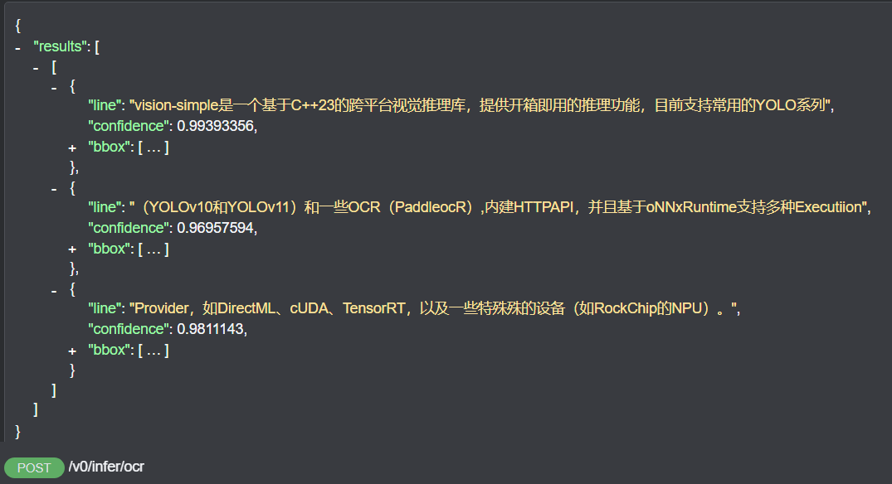
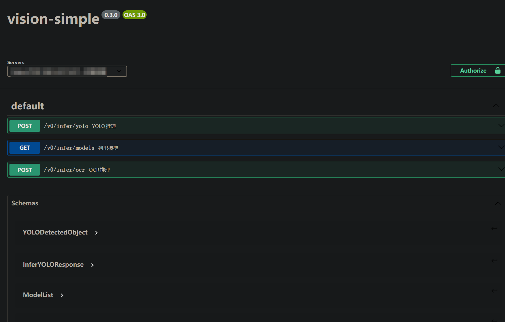

# <div align="center">🚀 vision-simple 🚀</div>
[english](./README-en.md) | 简体中文

<p align="center">
<a></a>
<a></a>
<a></a>
<a></a>
</p>

<p align="center">
<a></a>
<a></a>
<a></a>
</p>

<p align="center">
<a></a>
<a></a>
<a></a>
<a></a>
</p>

<p align="center">
<a></a>
<a></a>
<a></a>
<a></a>
</p>

`vision-simple` 是一个基于 C++23 的跨平台视觉推理库，旨在提供 **开箱即用** 的推理功能。通过 Docker用户可以快速搭建推理服务。该库目前支持常见的 YOLO 系列（包括 YOLOv10 和 YOLOv11），以及部分 OCR 模型（如 `PaddleOCR`）。**内建 HTTP API** 使得服务更加便捷。此外，`vision-simple` 采用 `ONNXRuntime` 引擎，支持多种 Execution Provider，如 `DirectML`、`CUDA`、`TensorRT`，并可与特定硬件设备（如 RockChip 的 RKNPU）兼容，提供更高效的推理性能。


## <div align="center">🚀 特性 </div>

- **跨平台**：支持`windows/x64`、`linux/x86_64`、`linux/arm64/v8`、`linux/riscv64`
- **多计算设备**：支持CPU、GPU、RKNPU
- **嵌入式设备**：目前已支持`rk3568`、`rv1106G3`（Luckfox Pico 1T算力版本）
- **小体积**：静态编译版本体积不到20MiB，推理YOLO和OCR占用300MiB内存
- **快速部署**：
  - **一键编译**：提供各个平台已验证的编译脚本
  - **[容器部署](https://hub.docker.com/r/lonacn/vision_simple)**：使用`docker`、`podman`、`container`一键部署
  - **[HTTP服务](doc/openapi/server.yaml)**：提供HTTP API供Web应用调用


### <div align="center"> yolov11n 3440x1440@60fps+ </div>


### <div align="center"> OCR(HTTP API) </div>


## <div align="center">🚀 部署使用 </div>
### docker部署HTTP服务
1. 启动server项目：
```sh
docker run -it --rm --name vs -p 11451:11451 lonacn/vision_simple:0.4.0-cpu-x86_64
```
2. 打开[swagger在线编辑器](https://editor-next.swagger.io/)，并允许该网站的不安全内容
3. 复制[doc/openapi/server.yaml](doc/openapi/server.yaml)的内容到`swagger在线编辑器`
4. 在编辑器右侧选择感兴趣的API进行测试：



## <div align="center">🚀 快速开始 </div>
### 开发YOLOv11推理

```cpp
#include <Infer.h>
#include <opencv2/opencv.hpp>
using namespace vision_simple;
template <typename T>
struct DataBuffer
{
    std::unique_ptr<T[]> data;
    size_t size;
    std::span<T> span(){return std::span{data.get(), size};}
};

extern std::expected<DataBuffer<uint8_t>, InferError> ReadAll(const std::string& path);

int main(int argc,char *argv[]){
    auto data = ReadAll("assets/hd2-yolo11n-fp32.onnx");
    auto image = cv::imread("assets/hd2.png");
    auto ctx = InferContext::Create(InferFramework::kONNXRUNTIME, InferEP::kDML);
    auto infer_yolo = InferYOLO::Create(**ctx, data->span(), YOLOVersion::kV11);
    auto result = infer_yolo->get()->Run(image, 0.625);
    // do what u want
    return 0;
}
```

### 构建项目
#### windows/x64
* [xmake](https://xmake.io) >= 2.9.7
* msvc with c++23
* windows 11

```powershell
# setup sln
./scripts/setupdev-vs.bat
# test
xmake build test_yolo
xmake run test_yolo
```
#### linux/x86_64
* [xmake](https://xmake.io) >= 2.9.7
* gcc-13
* debian12/ubuntu2022

```sh
# build release
./scripts/build-release.sh
# test
xmake build test_yolo
xmake run test_yolo
```
### docker镜像
所有`Dockerfile`位于目录：`docker/`

```sh
# 处于vision-simple根目录
# 构建项目
docker build -t vision-simple:latest -f  dockerfile/debian-x86_64.Dockefile .
# 运行容器，默认配置会使用CPU推理并监听11451端口
docker run -it --rm -p 11451:11451 --name vs vision-simple
```

## <div align="center">🚀 联系方式</div>


## <div align="center">📄 许可证</div>
项目内的YOLO模型和PaddleOCR模型版权归原项目所有

本项目使用**Apache-2.0**许可证
